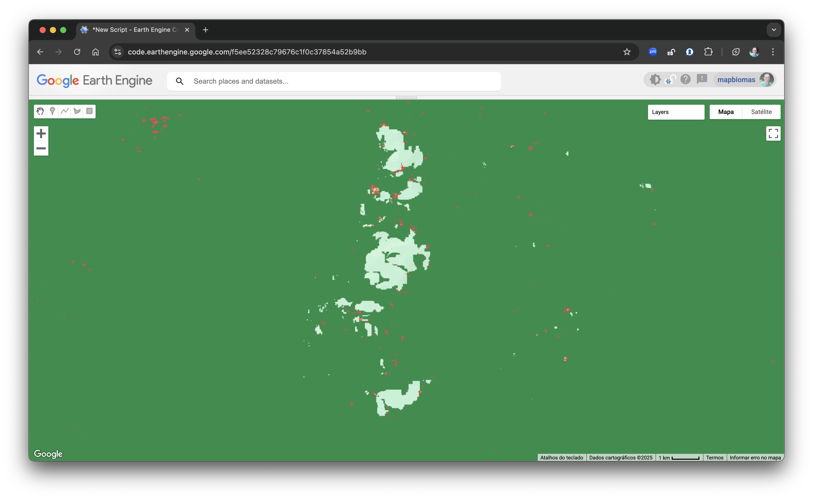
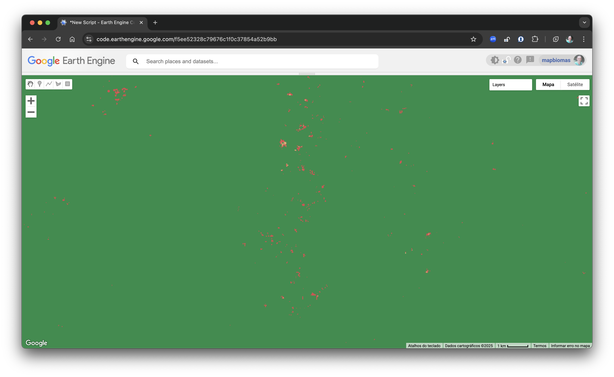

# Gap Fill Script for Land Cover Classification

This script performs a **temporal gap fill filter** on annual land cover classification maps using Google Earth Engine (GEE). The goal is to fill missing pixel values (`no data`) by using valid values from previous and subsequent years.

---

## Script Overview

The script processes classification maps by applying both **forward fill** (using the previous year) and **backward fill** (using the following year) strategies. The result is a more complete, temporally consistent dataset.

---

### 1. Initial Configuration

```js
// ========================
// Initial Configuration
// ========================

// Define the country or territory name.
// It must match the name used in the training samples and mosaics.
// Use uppercase letters, without spaces or underscores.
// Example: 'SURINAME' for Suriname.
var territory_name = 'SURINAME';

// Define region id
var region_id = '2';

// Collection ID and version for the stable map.
var collection_id = 1.0;
var input_version = '2';
var output_version = '2a';

// List of years to be processed.
var years = [
    2000, 2001, 2002, 2003, 2004, 2005, 2006, 2007,
    2008, 2009, 2010, 2011, 2012, 2013, 2014, 2015,
    2016, 2017, 2018, 2019, 2020, 2021, 2022, 2023,
];

// Pattern for naming the exported trained samples.
// Use '{territory_name}' as a placeholder for the territory name.
// Use '{version}' as a placeholder for the version number.
// Use '{region_id}' to specify the region ID.
// Example: 'SURINAME_1_5' for the classification of region with region_id 1 and input_version 1.
var classification_name_pattern = '{territory_name}_{region_id}_{version}';

// Path for input asset
var input_asset = 'projects/mapbiomas-suriname/assets/LAND-COVER/COLLECTION-1/TRAINING/classification';

// Path for the output asset
var output_asset = 'projects/mapbiomas-suriname/assets/LAND-COVER/COLLECTION-1/TRAINING/classification-ft';

// Description of the classification version.
var classification_version_description = [
    "### Classification Version Description",
    "- **Description**: Apply gap fill filter to improve land cover classification.",
    "- **Classification Version**: {input_version}",
    "- **Filtered Version**: {output_version}",
    "- **Region ID**: {region_id}",
];

// Color palette for each land cover class
var palette = [
    '#ffffff', // 0 - no data
    '#000000', // 1
    '#000000', // 2
    '#1f8d49', // 3 - forest
    '#000000', // 4
    '#000000', // 5
    '#000000', // 6
    '#000000', // 7
    '#000000', // 8
    '#000000', // 9
    '#000000', // 10
    '#519799', // 11 - wetland
    '#d6bc74', // 12 - grassland
    '#000000', // 13
    '#000000', // 14
    '#000000', // 15
    '#000000', // 16
    '#000000', // 17
    '#000000', // 18
    '#000000', // 19
    '#000000', // 20
    '#ffefc3', // 21 - mosaic_of_uses
    '#000000', // 22
    '#000000', // 23
    '#000000', // 24
    '#db4d4f', // 25 - non_vegetated_area
    '#000000', // 26
    '#000000', // 27
    '#000000', // 28
    '#000000', // 29
    '#000000', // 30
    '#000000', // 31
    '#000000', // 32
    '#2532e4', // 33 - water
];

// Visualization parameters for the map
var vis = {
    min: 0,
    max: 33,
    palette: palette,
    format: 'png',
};
```
---

### 2. Load Input Classification

```js
// Set input classification
var input_path = input_asset + '/' + classification_name_pattern
    .replace('{territory_name}', territory_name)
    .replace('{region_id}', region_id)
    .replace('{version}', input_version);

// Load the classification image
var classification = ee.Image(input_path);
print('Input classification', classification);

// Index of each year in the list of years
var years_index = ee.List.sequence(0, years.length - 1);
```

---

### 3. Gap Fill Functions

#### `gap_fill()`

```js
/**
 * @description 
 * Function to fill the missing values in the classification image.
 * @param current_year_index 
 * @param obj - The object containing the previous year image and the current year image.
 * @returns {Object} 
 */
var gap_fill = function (current_year_index, obj) {
    
    obj = ee.Dictionary(obj);

    // Get the previous year index as an integer
    var previous_year_index = ee.Number(current_year_index).subtract(1);

    // Get the previous image with all the bands
    var image_filled = ee.Image(obj.get('image_filled'));
    // Get the image base
    var image_base = ee.Image(obj.get('image_base'));

    // Get the current year image
    var current_image = image_base.select([ee.Number(current_year_index)]);
    // Get the previous year image
    var previous_image_filled = image_filled.select([previous_year_index]);

    // fill the missing values in the current year image
    var current_filled = current_image.unmask(previous_image_filled);

    // set the object with the previous year image
    // and the current year image
    obj = obj.set('image_filled', image_filled.addBands(current_filled));
    
    return obj;
};
```

- Main logic for replacing missing pixel values in a given year using the previous year's data.
- Used by both forward and backward filling.

#### `forward_fill()`

```js
/**
 * @description
 * Function to forward fill the missing values in the classification image.
 * It uses the previous year to fill the current year.
 * @param image - The classification image to be filled.
 * @returns {ee.Image} - The filled classification image.
 */
var forward_fill = function (image) {
    // Get the first year image
    var first = image.select([0]);

    // Iterate to fill missing bands
    var result = years_index.slice(1).iterate(gap_fill, {
        image_filled: first,
        image_base: image
    });

    // Extract the final result (all bands)
    return ee.Image(ee.Dictionary(result).get('image_filled'));
};
```

- Iteratively fills gaps from **left to right** (earlier years to later years).

#### `backward_fill()`

```js
/**
 * @description
 * Function to backward fill the missing values in the classification image.
 * It uses the previous year to fill the current year.
 * @param image - The classification image to be filled.
 * @returns {ee.Image} - The filled classification image.
 */
var backward_fill = function (image) {
    // Reverse the order of the bands
    image = image.select(years_index.reverse());

    // Get the last year image
    var last = image.select([0]);

    // Iterate to fill missing bands
    // The first band is the last year, so we start from the second band
    // and iterate backwards
    var result = years_index.slice(1).iterate(gap_fill, {
        image_filled: last,
        image_base: image
    });

    // Extract the final result (all bands)
    // Reverse the order of the bands back to the original
    return ee.Image(ee.Dictionary(result).get('image_filled')).select(years_index.reverse());
};
```

- Reverses band order and performs fill from **right to left** (later years to earlier years).

---

### 4. Apply Filtering

```js
// Apply the forward gap fill
var forward_filled = forward_fill(classification.selfMask());

// Apply the backward fill
var fully_filled = backward_fill(forward_filled);

print('output classification', fully_filled);
```

- Combines both directions of gap filling.
- `selfMask()` is used to ensure only valid pixels are considered in the filling process.

<p float="left">
<figure style="display: inline-block; margin-right: 20px; text-align: center;">
<figcaption>Before Filter</figcaption>

</figure>

<figure style="display: inline-block; text-align: center;">
<figcaption>After Filter</figcaption>

</figure>
</p>

---

### 5. Add Metadata

```js
// Write metadata to the output classification (important for tracking and exporting)
var classification_filtered = fully_filled
    .set('description', classification_version_description.join('\n'))
    .set('collection_id', collection_id)
    .set('version', output_version)
    .set('territory', territory_name)
    .set('step', 'frequency_filter');
```

- Stores metadata in the exported image, useful for traceability and documentation.

---

### 6. Export Result to GEE Asset

```js
// Define output path name based on the naming pattern
var output_name = classification_name_pattern
    .replace('{territory_name}', territory_name)
    .replace('{region_id}', region_id)
    .replace('{version}', output_version);

// Export the processed classification image as a GEE asset
Export.image.toAsset({
    image: classification_filtered,
    description: output_name,
    assetId: output_asset + '/' + output_name,
    pyramidingPolicy: { '.default': 'sample' },
    region: classification.geometry().bounds(),
    scale: 30,
    maxPixels: 1e13
});
```

- Exports the final, gap-filled classification image as a new Earth Engine asset.

---

### 7. Map Layers for Visualization

```js

vis['bands'] = ['classification_2020'];

Map.addLayer(classification, vis, 'classification', false);
Map.addLayer(classification_filtered, vis, 'classification gap filled', false);
```

- Adds both the original and filtered classifications to the GEE Map viewer for comparison.

---
