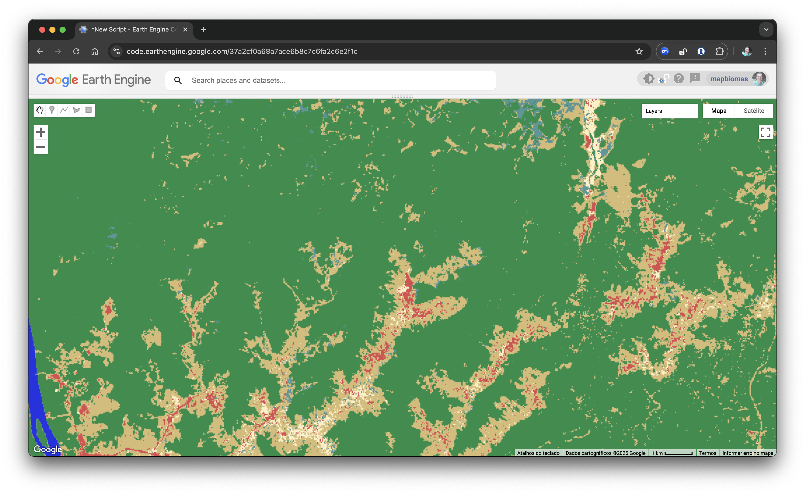
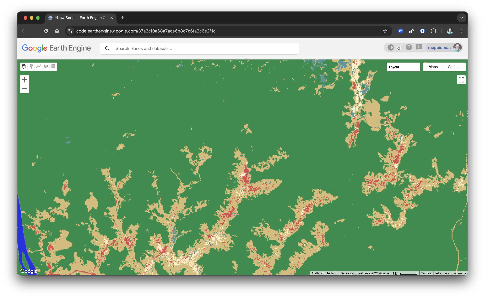

# Frequency Filter Script

This Google Earth Engine script applies a frequency filter to land use and land cover classification images based on the consistent presence of native classes (forest, wetlands, and grasslands).

---

## 1. Initial Configuration

Defines the main parameters, such as territory name, region ID, input version, the list of years to be processed, and the color palette used for visualization in the map.

```javascript
// ========================
// Initial Configuration
// ========================

// Define the country or territory name.
// It must match the name used in the training samples and mosaics.
// Use uppercase letters, without spaces or underscores.
// Example: 'SURINAME' for Suriname.
var territory_name = 'SURINAME';

// Define region id
var region_id = '1';

// Collection ID and version for the stable map.
var collection_id = 1.0;
var input_version = '5';
var output_version = '5a';

// List of years to be processed.
var years = [
    2000, 2001, 2002, 2003, 2004, 2005, 2006, 2007,
    2008, 2009, 2010, 2011, 2012, 2013, 2014, 2015,
    2016, 2017, 2018, 2019, 2020, 2021, 2022, 2023,
];

// Pattern for naming the exported trained samples.
// Use '{year}' as a placeholder to be replaced with each processing year.
// Use '{version}' as a placeholder for the version number.
// Use '{region_id}' to specify the region ID.
// Example: 'SURINAME_1_5' for the classification of region with region_id 1 and input_version 1.
var classification_name_pattern = '{territory_name}_{region_id}_{version}';

// Path for input asset
var input_asset = 'projects/mapbiomas-suriname/assets/LAND-COVER/COLLECTION-1/TRAINING/classification-ft';

// Path for the output asset
var output_asset = 'projects/mapbiomas-suriname/assets/LAND-COVER/COLLECTION-1/TRAINING/classification-ft';

// Description of the classification version.
var classification_version_description = [
    "### Classification Version Description",
    "- **Description**: Apply frequency filtering to improve land cover classification.",
    "- **Classification Version**: {input_version}",
    "- **Filtered Version**: {output_version}",
    "- **Region ID**: {region_id}",
];

// Color palette for each land cover class
var palette = [
    '#ffffff', // 0 - no data
    '#000000', // 1
    '#000000', // 2
    '#1f8d49', // 3 - forest
    '#000000', // 4
    '#000000', // 5
    '#000000', // 6
    '#000000', // 7
    '#000000', // 8
    '#000000', // 9
    '#000000', // 10
    '#519799', // 11 - wetland
    '#d6bc74', // 12 - grassland
    '#000000', // 13
    '#000000', // 14
    '#000000', // 15
    '#000000', // 16
    '#000000', // 17
    '#000000', // 18
    '#000000', // 19
    '#000000', // 20
    '#ffefc3', // 21 - mosaic_of_uses
    '#000000', // 22
    '#000000', // 23
    '#000000', // 24
    '#db4d4f', // 25 - non_vegetated_area
    '#000000', // 26
    '#000000', // 27
    '#000000', // 28
    '#000000', // 29
    '#000000', // 30
    '#000000', // 31
    '#000000', // 32
    '#2532e4', // 33 - water
];

// Visualization parameters for the map
var vis = {
    min: 0,
    max: 33,
    palette: palette,
    format: 'png',
};
```

---

## 2. calculate_frequency Function

Helper function that calculates the frequency of a given class in a multiband classification image.

```javascript
/**
 * @description This function calculates the frequency of a specific class in the input image.
 * @param {*} image 
 * @param {*} class_id 
 * @returns {ee.Image} The frequency of the specified class in the input image.
 */
var calculate_frequency = function (image, class_id) {
    // Calculate the frequency of the specified class
    var frequency = image.eq(class_id).reduce(ee.Reducer.sum()).divide(image.bandNames().length());
    
    return frequency;
};
```

---

## 3. frequency_filter_apply Function

Applies a frequency filter for native vegetation classes. It defines specific thresholds and replaces original values based on temporal consistency.

```javascript
/**
 * 
 * @description
 * This function applies a frequency filter to the input image.
 * It calculates the frequency of different classes of vegetation and applies a filter based on predefined thresholds.
 * @param {*} image 
 * @returns {ee.Image} The filtered image after applying the frequency filter.
 */
var frequency_filter_apply = function (image) {

    // Get frequency of different classes of vegetation
    var forest_frequency = calculate_frequency(image, 3);     // Forest
    var wetland_frequency = calculate_frequency(image, 11);   // Wetland
    var grassland_frequency = calculate_frequency(image, 12); // Grassland

    // Get frequency of all native vegetation classes
    var native_frequency = forest_frequency.add(wetland_frequency).add(grassland_frequency);

    // Threshold for stable native vegetation
    var native_threshold = 0.9;

    // Create a mask for stable native vegetation
    var stable_native_mask = ee.Image(0)
        .where(native_frequency.gte(native_threshold), 1);

    // Thresholds for filtering
    var forest_threshold = 0.75;
    var wetland_threshold = 0.6;
    var grassland_threshold = 0.5;

    // Replace the values of the classes with the filtered values
    var filtered = ee.Image(0)
        .where(forest_frequency.gte(forest_threshold), 3)
        .where(wetland_frequency.gte(wetland_threshold), 11)
        .where(grassland_frequency.gte(grassland_threshold), 12);

    // Apply the mask to the filtered image
    var image_filtered = image.where(filtered.gt(0), filtered);

    return image_filtered;
};
```

---

## 4. Input and Filter Execution

Loads the original classification image based on the defined pattern and applies the filtering function.

```javascript
// Set input classification
var input_path = input_asset + '/' + classification_name_pattern
    .replace('{territory_name}', territory_name)
    .replace('{region_id}', region_id)
    .replace('{version}', input_version);

// Load the classification image
var classification = ee.Image(input_path);
print('Input classification', classification);

// Apply the filter function to the input classification image
var classification_filtered = frequency_filter_apply(classification);
print('Filtered classification', classification_filtered);
```

<p float="left">
<figure style="display: inline-block; margin-right: 20px; text-align: center;">
<figcaption>Before Filter</figcaption>

</figure>

<figure style="display: inline-block; text-align: center;">
<figcaption>After Filter</figcaption>

</figure>

</p>

---

## 5. Export Processed Image

Defines the export name using the naming pattern and exports the filtered result to a new asset in GEE.

```javascript
// Write metadata to the output classification (important for tracking and exporting)
classification_filtered = classification_filtered
    .set('description', classification_version_description.join('\n'))
    .set('collection_id', collection_id)
    .set('version', output_version)
    .set('territory', territory_name)
    .set('step', 'frequency_filter');

// Define output path name based on the naming pattern
var output_name = classification_name_pattern
    .replace('{territory_name}', territory_name)
    .replace('{region_id}', region_id)
    .replace('{version}', output_version);

// Export the processed classification image as a GEE asset
Export.image.toAsset({
    image: classification_filtered,
    description: output_name,
    assetId: output_asset + '/' + output_name,
    pyramidingPolicy: {'.default': 'sample'},
    region: classification.geometry().bounds(),
    scale: 30,
    maxPixels: 1e13
});
```

---

## 6. Map Visualization

Adds layers to the map for each year defined in the `years` array, allowing side-by-side visualization of the original and filtered classifications.

```javascript
// Add the original and filtered classification images to the map for visualization
years.forEach(
    function(year) {
        // Define the band name for the current year
        var band = 'classification_' + year.toString();

        // Select the classification band for the current year
        var classification_year = classification.select([band]);

        // Select the filtered classification band for the current year
        var classification_filtered_year = classification_filtered.select([band]);

        // Add layers to the map for visualization
        Map.addLayer(classification_year, vis, band);
        Map.addLayer(classification_filtered_year, vis, band + '_filtered');
    }
);

```
