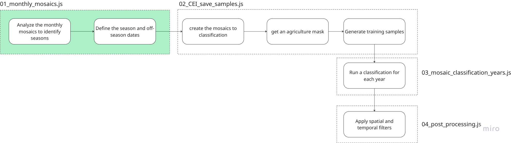
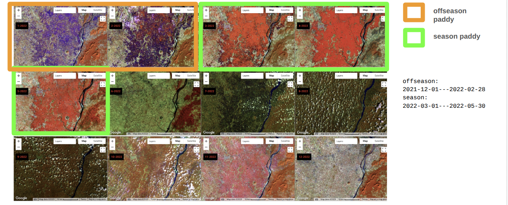

## Pipeline
This script demonstrates the crop classification pipeline, covering the following key steps:





## Main Components

### 1. **Functions**
Custom utility functions to handle Landsat preprocessing:

- `filterLandsatCollection(path, roi, startDate, endDate)`  
  Filters a Landsat collection based on a region and date range.

- `padronizeBandNames(image)`  
  Standardizes the band names to a consistent naming scheme.

- `maskClouds(image)`  
  Applies a detailed QA bitmask to filter out clouds, shadows, snow, water, and cirrus.

- `applyContrast(image, roi)`  
  Improves visualization by rescaling pixel values to the 2nd and 98th percentiles.

---

### 2. **Band Name Dictionary**

The `bandNames` dictionary maps the native bands of each Landsat satellite to standard band names:
- `blue`, `green`, `red`, `nir`, `swir1`, `swir2`, `tir1`, `BQA`

This ensures compatibility when merging different Landsat sensors.

---

### 3. **Cloud Masking Logic**

Two methods are defined for cloud masking:
- Simple method using bitwise flags
- Advanced method using `qaBits` that decodes multiple conditions like cloud, snow, shadow, cirrus using bit ranges

---

### 4. **Loading the Image Collections**

Each Landsat collection is filtered by:
- Geometry (scene centroid)
- Cloud cover threshold (80%)
- Date range

Collections loaded:
- **Landsat 5 (2000–2011)**
- **Landsat 7 (2000–2013)**
- **Landsat 8 (2013+)**
- **Landsat 9 (2021+)**

---

### 5. **Merging and Preprocessing**

All filtered collections are merged and processed using:
- Band standardization
- (Optional) cloud masking
- Optional contrast enhancement (for visualization only)

---

### 6. **Monthly Mosaic Generation**

A loop is run over each month of a target year (e.g., 2000). For each month:
- A filtered mosaic is generated using `median()`
- A map widget is created and labeled with the corresponding month
- The image is rescaled using 2nd–98th percentile contrast
- The map is added to the interface

---

### 7. **UI Visualization Panel**

- Maps are arranged horizontally using `ui.Panel.Layout.Flow('horizontal')`
- All 12 months are displayed side-by-side
- Interactivity is enabled: zoom, pan, inspect
- Maps are linked using `ui.Map.Linker(mapas)` to synchronize navigation

---


```javascript

var scene = /* color: #d63000 */ee.Geometry.Polygon(
        [[[82.72936800501485, 21.026987513972603],
          [84.46567788705137, 20.66754768261035],
          [84.87780236135998, 22.4052256913507],
          [83.11397732767647, 22.76037256411636]]]);

// --------------------------------------------
// Filter Landsat collection by date and region
// --------------------------------------------
function filterLandsatCollection(landsatCollectionPath, roi, startDate, endDate){
  var filteredCollection = ee.ImageCollection(landsatCollectionPath)
      .filterDate(startDate, endDate)
      .filterBounds(roi); 
  return filteredCollection;
}

// --------------------------------------------
// Dictionary to rename raw Landsat band names
// to a standard format for all satellites
// --------------------------------------------
var bandNames = ee.Dictionary({
  'LANDSAT_5': ['B1', 'B2', 'B3', 'B4', 'B5', 'B7', 'B6', 'QA_PIXEL'],
  'LANDSAT_7': ['B1', 'B2', 'B3', 'B4', 'B5', 'B7', 'B6_VCID_1','QA_PIXEL'],
  'LANDSAT_8': ['B2', 'B3','B4', 'B5', 'B6', 'B7', 'B10', 'QA_PIXEL'],
  'LANDSAT_9': ['B2', 'B3','B4', 'B5', 'B6', 'B7', 'B10', 'QA_PIXEL']
});

// --------------------------------------------
// Rename each image’s bands to standardized names
// --------------------------------------------
function padronizeBandNames(image){
  var oldBandNames = bandNames.get(image.get('SPACECRAFT_ID'));
  var newBandNames = ['blue', 'green', 'red', 'nir', 'swir1', 'swir2', 'tir1', 'BQA'];
  return image.select(oldBandNames, newBandNames);
}

// --------------------------------------------
// Cloud mask function using QA_PIXEL band
// (bitmask approach)
// --------------------------------------------
function maskClouds(image){
  var qa = image.select('BQA');
  var mask = qa.bitwiseAnd(1 << 3).and(qa.bitwiseAnd(1 << 8).or(qa.bitwiseAnd(1 << 9))) // Clouds
            .or(qa.bitwiseAnd(1 << 1)) // Dilated cloud  
            .or(qa.bitwiseAnd(1 << 4).and(qa.bitwiseAnd(1 << 10).or(qa.bitwiseAnd(1 << 11)))) // Shadows
            .or(qa.bitwiseAnd(1 << 5)) // Snow  
            .or(qa.bitwiseAnd(1 << 7)) // Water  
            .or(qa.bitwiseAnd(1 << 14).and(qa.bitwiseAnd(1 << 15))) // Cirrus
  return image.updateMask(mask.not());
}

// --------------------------------------------
// Enhance image visualization by clipping pixel
// values between 2nd and 98th percentiles
// --------------------------------------------
function applyContrast(image, roi){
  var stats = image.reduceRegion({
    reducer: ee.Reducer.percentile([2, 98]),
    geometry: roi, 
    scale: 30,
    maxPixels: 1E13
  });
    
  var imageVis = image.bandNames().iterate(function(bandName, currentImage){
      bandName = ee.String(bandName);
      currentImage = ee.Image(currentImage);
      
      var p2 = bandName.cat(ee.String('_p2'));
      var p98 = bandName.cat(ee.String('_p98'));
      
      return currentImage.addBands(currentImage.select(bandName)
        .clamp(stats.getNumber(p2), stats.getNumber(p98)), null, true);
        
    }, image);
  
  return ee.Image(imageVis);
}

// --------------------------------------------
// CLOUD MASKING: BQA bit decoding (alternative approach)
// --------------------------------------------

/** Define bitwise masks for different conditions */
var qaBits = ee.List([
  [0, 0, 0],    // fill
  [1, 1, 0],    // clear
  [2, 5, 0],    // cloud
  [8, 9, 1],    // cloud shadow
  [10, 11, 1],  // snow
  [12, 13, 1],  // cirrus
]);

// Decode selected QA bits from BQA band
function getQABits(image, start, end) {
  var pattern = ee.Number(ee.List.sequence(start, end).distinct().iterate(function(i, pattern){
    return ee.Number(pattern).add(ee.Number(2).pow(ee.Number(i)));
  }, ee.Number(0)));
  return image.select(0).bitwiseAnd(pattern.int()).rightShift(start);
}

// Alternative cloud masking with multiple QA bit filters
function maskClouds(image){
  var bqa = image.select('BQA');
  var inital_state = ee.Dictionary({
    'bqa': bqa,
    'mask': ee.Image(1)  
  });
  
  var finalState = ee.Dictionary(qaBits.iterate(function(bits, state){
    bits = ee.List(bits);
    state = ee.Dictionary(state);
    
    var bqa = ee.Image(state.get('bqa'));
    var mask = ee.Image(state.get('mask'));

    var start = bits.getNumber(0);
    var end = bits.getNumber(1);
    var desired = bits.getNumber(2);

    var blueprint = getQABits(bqa, start, end).eq(desired);

    return ee.Dictionary({
        'bqa': bqa,
        'mask': mask.updateMask(blueprint)
    });
    
  }, inital_state));
  
  var cloudMask = ee.Image(finalState.get('mask'));
  return image.updateMask(cloudMask);
}


/************************************** LOAD COLLECTIONS **********************************/
/************************************** LOAD COLLECTIONS **********************************/


// Get centroid of the analysis region (scene)
var centroid = scene.centroid(30)

// Load and filter Landsat collections by date and cloud cover
var l5Collection = ee.ImageCollection(filterLandsatCollection("LANDSAT/LT05/C02/T1_TOA", centroid, "2000-01-01", "2011-10-01"));
var l7Collection1 = ee.ImageCollection(filterLandsatCollection("LANDSAT/LE07/C02/T1_TOA", centroid, "2000-01-01", "2003-05-31"));
var l7Collection2 = ee.ImageCollection(filterLandsatCollection("LANDSAT/LE07/C02/T1_TOA", centroid, "2011-10-01", "2013-03-01"));
var l8Collection = ee.ImageCollection(filterLandsatCollection("LANDSAT/LC08/C02/T1_TOA", centroid, "2013-03-01", "2030-01-01"));
var l9Collection = ee.ImageCollection(filterLandsatCollection("LANDSAT/LC09/C02/T1_TOA", centroid, "2019-03-01", "2030-01-01"));

// Merge collections and apply band renaming
var collection = l8Collection.merge(l9Collection)
                .merge(l7Collection1)
                .merge(l7Collection2) // you can comment the landsat 7 to the years that you have other sensor images
                .merge(l5Collection)
                .map(padronizeBandNames)
                // .map(maskClouds);  // optionally uncomment to apply cloud mask

// Print band names for inspection
print(collection.first().bandNames());

/************************************** MAP UI FOR VISUALIZATION **********************************/

// Visualization parameters
var vis = {bands: ['nir', 'swir1', 'red'], min: 0, max: 0.5}

// Define year of analysis
var year = 2024

// Define months to loop over (1 to 12)
var meses = [1,2,3,4,5,6,7,8,9,10,11,12]

// Loop over each month to create a mini-map showing the monthly median mosaic
var mapas = meses.map(function(mes){
  
  var dataInicio = ee.Date(year + '-' + mes + '-01');
  var dataFim = dataInicio.advance(1, 'month');

  // Filter collection to the month and calculate median mosaic
  var mosaico_mensal = collection
                        .filterDate(dataInicio, dataFim)
                        .median();
  
  // Create small map widget for the month
  var mapa_menor = ui.Map({
    style: {
      border: '1px solid gray',
      height: '33%',
      width: '25%'
    }
  });

  mapa_menor.setControlVisibility({ 'all': true });
  
  // Add label showing month/year
  mapa_menor.add(ui.Label(mes + '-' + year, {
    'position': 'top-left',
    'fontWeight': 'bold',
    "background-color": 'black',
    "color": 'red'
  }));

  // Add layer with contrast-enhanced visualization
  mapa_menor.addLayer(
    applyContrast(mosaico_mensal.select(vis['bands']), scene),
    {},
    'Monthly Mosaic'
  );

  return mapa_menor;
});

// Center first mini-map and link all maps together
mapas[0].centerObject(scene, 12)
var linker = ui.Map.Linker(mapas);

// Display all maps in horizontal layout
ui.root.widgets().reset(mapas);
ui.root.setLayout(ui.Panel.Layout.Flow('horizontal', true));


```

## How to Use

1. Load this script into the [Google Earth Engine Code Editor](https://code.earthengine.google.com/).
2. Define a geometry called `scene` at the top of your script.
3. Optionally activate cloud masking or contrast enhancements.
4. Adjust the year by modifying `var year = 2000`.
5. Run the script and explore the 12 monthly mosaics.

---


## Notes

- This script is optimized for India but can be adapted to other regions.
- Currently using `TOA` reflectance products; you may change to `SR` products if surface reflectance is preferred.
- CEI calculation logic (EVI2, NDWI) is not included in this version, but can be easily integrated.

\
\
YOU CAN ACESS THE FULL CODE HERE:\
https://code.earthengine.google.com/2e2f79db6c442c71ce8ac9f4896c2700 

---

## Contact

Developed by [MapBiomas](https://brasil.mapbiomas.org/en/)  
Author: Kenia Mourão – kenia.mourao@remapgeo.com
