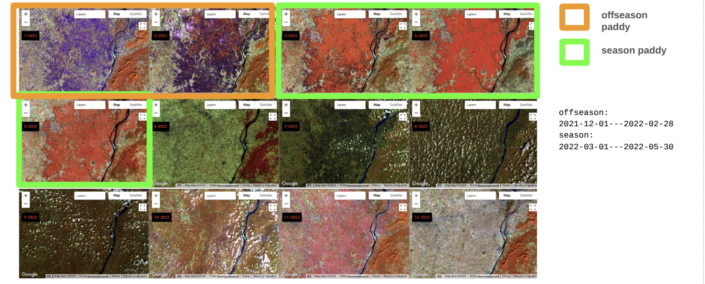

## Pipeline
This script demonstrates the crop classification pipeline, covering the following key steps:


## Introduction
This Google Earth Engine script is designed to generate seasonal and off-season mosaics from Landsat imagery. It calculates the Crop Expansion Index (CEI) using EVI2 (Enhanced Vegetation Index 2) and NDWI (Normalized Difference Water Index) to identify potential irrigated agricultural areas, specifically tailored for crop detection (e.g., paddy fields). Additionally, it facilitates the export of training samples for machine learning classification.

##Geometry Definition
The script begins by defining a polygonal geometry that represents the Area of Interest (AOI). This ee.Geometry.Polygon is used to clip and filter the imagery and for sampling.


```javascript
var scene = ee.Geometry.Polygon(
  [[[82.72936800501485, 21.026987513972603],
    [84.46567788705137, 20.66754768261035],
    [84.87780236135998, 22.4052256913507],
    [83.11397732767647, 22.76037256411636]]]);
```
## Helper Functions
A set of helper functions are defined to streamline the image processing workflow.

**filterLandsatCollection**\
This function filters Landsat image collections by a specified date range and spatial region (Region of Interest - ROI).


```javascript
function filterLandsatCollection(path, roi, startDate, endDate) {
  return ee.ImageCollection(path)
    .filterDate(startDate, endDate)
    .filterBounds(roi);
}
```

**padronizeBandNames**\
This function standardizes band names across different Landsat satellites (Landsat 5, 7, 8, and 9) to a common set of names (blue, green, red, nir, swir1, swir2, tir1, BQA). This ensures consistency when merging collections from different sensors.

```javascript
var bandNames = ee.Dictionary({
  'LANDSAT_5': ['B1', 'B2', 'B3', 'B4', 'B5', 'B7', 'B6', 'QA_PIXEL'],
  'LANDSAT_7': ['B1', 'B2', 'B3', 'B4', 'B5', 'B7', 'B6_VCID_1','QA_PIXEL'],
  'LANDSAT_8': ['B2', 'B3','B4', 'B5', 'B6', 'B7', 'B10', 'QA_PIXEL'],
  'LANDSAT_9': ['B2', 'B3','B4', 'B5', 'B6', 'B7', 'B10', 'QA_PIXEL']
});

function padronizeBandNames(image) {
  var oldNames = bandNames.get(image.get('SPACECRAFT_ID'));
  var newNames = ['blue', 'green', 'red', 'nir', 'swir1', 'swir2', 'tir1', 'BQA'];
  return image.select(oldNames, newNames);
}

```


**maskClouds**\
This function applies a comprehensive cloud, shadow, snow, and water mask to Landsat images using the QA_PIXEL band's bit flags. Pixels identified as affected by these conditions are masked out.

```javascript
function maskClouds(image) {
  var qa = image.select('BQA');
  var mask = qa.bitwiseAnd(1 << 3).and(qa.bitwiseAnd(1 << 8).or(qa.bitwiseAnd(1 << 9))) // Cloud
             .or(qa.bitwiseAnd(1 << 1))  // Dilated cloud
             .or(qa.bitwiseAnd(1 << 4).and(qa.bitwiseAnd(1 << 10).or(qa.bitwiseAnd(1 << 11)))) // Shadow
             .or(qa.bitwiseAnd(1 << 5))  // Snow
             .or(qa.bitwiseAnd(1 << 7))  // Water
             .or(qa.bitwiseAnd(1 << 14).and(qa.bitwiseAnd(1 << 15))); // Cirrus
  return image.updateMask(mask.not());
}

```


**getEVI2**\
Calculates the Enhanced Vegetation Index 2 (EVI2) for an image and adds it as a new band named evi2. EVI2 is a vegetation index similar to EVI but without the blue band, making it suitable for sensors where the blue band might be noisy or unavailable.

Formula: $2.5 * (NIR - RED) / (NIR + 2.4 * RED + 1)$

```javascript
function getEVI2(image) {
  var evi2 = image.expression(
    '2.5 * (b("nir") - b("red")) / (b("nir") + 2.4 * b("red") + 1)'
  ).rename("evi2");
  return image.addBands(evi2);
}
```
\
**getNDWI**\
Calculates the Normalized Difference Water Index (NDWI) for an image and adds it as a new band named ndwi. NDWI is useful for delineating open water features.

Formula: (NIR−SWIR1)/(NIR+SWIR1)


```javascript

function getNDWI(image) {
  var ndwi = image.expression(
    '(b("nir") - b("swir1")) / (b("nir") + b("swir1"))'
  ).rename("ndwi");
  return image.addBands(ndwi);
}
```



## User settings


This section defines parameters that can be adjusted by the user, such as the target year and seasonal definitions for crop analysis.

`year`: The target year for which mosaics and analyses will be performed.
\
\
`cloudCoverValue`: A threshold (currently unused in the provided code but often present in similar scripts) for filtering images based on cloud cover percentage.
\
\
`settings_uf`: A dictionary containing seasonal configuration for specific crop types. In this case, it's configured for 'crop' (e.g., paddy) with defined offseason_startDate, offseason_endDate, season_startDate, and season_endDate.\
\
\
It also lists the bands (cei_ndwi, swir1_offseason, swir2_offseason) that will be selected for a final mosaic layer.

```javascript
var year = 2022; // you can change the year


var settings_uf = {
  'crop': {
    uf: 'crop',
    offseason_startDate: (year - 1) + '-12-01',
    offseason_endDate: year + '-02-28',
    season_startDate: year + '-03-01',
    season_endDate: year + '-05-30',
    bands: ['cei_ndwi', 'swir1_offseason', 'swir2_offseason'],
  },
};

```
\
## Main Processing Loop
\
\
The core logic of the script resides within a loop that iterates through the defined settings (though currently only one 'crop' setting is present).

```javascript
for (var key in settings_uf) {
  if (settings_uf.hasOwnProperty(key)) {
    var state = settings_uf[key];
    var centroid = scene.centroid(30); // Centroid of the AOI
    // ... (rest of the processing steps)
  }
}

```
\
**Landsat Collection Loading and Preprocessing**
\
\
Inside the loop, various Landsat collections (Landsat 5, 7, 8, and 9) are loaded and filtered by the defined centroid and date ranges. These collections are then merged and preprocessed using the helper functions:

`padronizeBandNames`: Standardizes band names.

`maskClouds`: Applies cloud/shadow/snow/water masking.

`getEVI2`: Computes and adds the EVI2 band.

`getNDWI`: Computes and adds the NDWI band.

```javascript
var l5 = filterLandsatCollection("LANDSAT/LT05/C02/T1_TOA", centroid, "2000-01-01", "2011-10-01");
    var l7a = filterLandsatCollection("LANDSAT/LE07/C02/T1_TOA", centroid, "2000-01-01", "2003-05-31");
    var l7b = filterLandsatCollection("LANDSAT/LE07/C02/T1_TOA", centroid, "2011-10-01", "2013-03-01");
    var l8 = filterLandsatCollection("LANDSAT/LC08/C02/T1_TOA", centroid, "2013-03-01", "2030-01-01");
    var l9 = filterLandsatCollection("LANDSAT/LC09/C02/T1_TOA", centroid, "2019-03-01", "2030-01-01");

    var collection = l8.merge(l9).merge(l7a).merge(l7b)
      .map(padronizeBandNames)
      .map(maskClouds)
      .map(getEVI2)
      .map(getNDWI);

```
\
**Seasonal and Off-Season Mosaic Creation**\
\
The preprocessed collection is then used to create two distinct mosaics based on the defined seasonal and off-season periods:

`season_mosaic`: Created using a `qualityMosaic` based on the maximum EVI2 value, which helps to select the clearest and greenest pixels during the growing season. Bands are suffixed with `_season`.

`offseason_mosaic`: Created using the `min()` reducer, which selects the minimum pixel value across the off-season period. This can be effective for identifying bare soil or water. Bands are suffixed with `_offseason`.

Finally, these two mosaics are combined into a single `mosaic` image.

```javascript
var season_start = state.season_startDate;
    var season_end = state.season_endDate;
    var offseason_start = state.offseason_startDate;
    var offseason_end = state.offseason_endDate;

    print('Season:', season_start, 'to', season_end);
    print('Offseason:', offseason_start, 'to', offseason_end);

    var season_mosaic = collection.filterDate(season_start, season_end)
                                 .qualityMosaic('evi2');

    season_mosaic = season_mosaic.rename(
      season_mosaic.bandNames().map(function(b) {
        return ee.String(b).cat("_season");
      })
    );

    var offseason_mosaic = collection.filterDate(offseason_start, offseason_end)
                                   .filterBounds(grid)
                                   .min();

    offseason_mosaic = offseason_mosaic.rename(
      offseason_mosaic.bandNames().map(function(b) {
        return ee.String(b).cat("_offseason");
      })
    );

    var mosaic = season_mosaic.addBands(offseason_mosaic);
```

## CEI Calculation
The Crop Expansion Index (CEI) is calculated for both EVI2 and NDWI using the following formula:

Formula: $100 * (season - offseason) / (100 + season + 100 + offseason)$
\
\
Where:

**season** refers to the seasonal index (e.g., `evi2_season`).

**offseason** refers to the off-season index (e.g., `evi2_offseason`).
\
\

The calculated CEI bands (`cei_evi2, cei_ndwi`) are added to the mosaic image. The final mosaic is unmasked and clipped to the scene geometry.

```javascript
var cei = mosaic.expression(
      '100 * (season - offseason) / (100 + season + 100 + offseason)', {
        'season': mosaic.select(['evi2_season', 'ndwi_season']),
        'offseason': mosaic.select(['evi2_offseason', 'ndwi_offseason'])
      }).rename(['cei_evi2', 'cei_ndwi']);

    mosaic = mosaic.addBands(cei).unmask().clip(scene);

    var mosaic_CEI = mosaic.select(['cei_evi2', 'cei_ndwi']);
    var mosaic_season = mosaic.select(['evi2_season', 'ndwi_season']);
    var mosaic_offseason = mosaic.select(['evi2_offseason', 'ndwi_offseason']);
```

## Visualization
Various layers are added to the Earth Engine map for visual inspection. These include:

False-color composites for both off-season and season.

Off-season and season NDWI mosaics.

CEI NDWI mosaic.

A combined mosaic using the bands specified in `state.bands`.

```javascript
    var band = 'ndwi';
    var palette = ['red', 'yellow', 'green'];

    Map.addLayer(mosaic, {bands: ['nir_offseason', 'swir1_offseason', 'red_offseason'], min: 0, max: 0.5}, 'offSeason', false);
    Map.addLayer(mosaic, {bands: ['nir_season', 'swir1_season', 'red_season'], min: 0, max: 0.5}, 'Season', false);
    Map.addLayer(mosaic_offseason.select(band + '_offseason'), {min: 0, max: 0.5, palette: palette}, band + '_offseason mosaic', false);
    Map.addLayer(mosaic_season.select(band + '_season'), {min: 0, max: 0.5, palette: palette}, band + '_season mosaic', false);
    Map.addLayer(mosaic_CEI.select('cei_' + band), {min: 0, max: 0.2, palette: palette}, 'CEI_' + band + ' mosaic', false);
    Map.addLayer(mosaic.select(state.bands), {min: 0, max: 0.3}, 'Mosaic', false);

```

\
## Agricultural Masking
A binary mask named `agric_mask` is created by applying a threshold of `0.17` to the cei_ndwi band. Pixels with cei_ndwi greater than or equal to ´0.17´ are classified as potential agricultural areas (e.g., rice fields). 

> **Important**\
YOU HAVE TO ANALYSE THE RESULTS TO CHOSE A NUMBER OF THRESHOLD

\

```javascript
    var agric_mask = mosaic.select('cei_ndwi').gte(0.17).rename('class');
    Map.addLayer(agric_mask, {}, 'mask rice', false);
```


## Training Sample Generation
Training samples are generated from the mosaic image combined with the `agric_mask`. The sample function extracts pixels from the specified region (`scene`) at a scale of 30 meters. It samples 1000 pixels (`numPixels`) and includes the geometry of each sampled point (`geometries: true`).

```javascript
var training = mosaic.addBands(agric_mask).sample({
      region: scene,
      scale: 30,
      numPixels: 1000,
      tileScale: 4, // Higher tileScale can help with memory issues for large regions
      geometries: true
    });

Map.addLayer(training.filter(ee.Filter.eq('class', 1)), {color: 'red'}, 'crop samples')
Map.addLayer(training.filter(ee.Filter.eq('class', 0)), {color: 'yellow'}, 'other samples')
```


\
# Random Forest Classification
A Random Forest classifier with 100 trees (`ee.Classifier.smileRandomForest(100)`) is trained using the generated training samples. The classifier learns to predict the class (0 or 1 from the `agric_mask`) based on all the bands available in the mosaic image. The trained classifier is then used to classify the entire mosaic image.
\

```javascript
var classifier = ee.Classifier.smileRandomForest(100)
                                 .train(training, 'class', mosaic.bandNames());

    var classified = mosaic.classify(classifier)
                           .set('year', year)
                           .rename(['classification']);

    Map.addLayer(classified, {min: 0, max: 1}, 'result', false);

```

## Export Training Samples
The generated `training` samples (a `FeatureCollection`) are exported to a Google Earth Engine asset. This allows for persistent storage and reuse of the training data in future analyses or model development.

```javascript
var filename = 'samples_v1';
    var output = 'projects/mapbiomas-india/assets/AGRICULTURE/' + filename;

    Export.table.toAsset({
      collection: training,
      description: filename,
      assetId: output,
      maxVertices: 1e13, // Increased maxVertices to prevent truncation for large collections
    });
```

## **Usage**
To use this script:

* Open the Google Earth Engine Code Editor. 

* Copy and paste the entire script into a new script file.

* Adjust the year variable and settings_uf for different periods or crop types if needed.

* Modify the scene geometry to your specific Area of Interest.

* Run the script.

* The generated mosaics and classification results will be displayed on the map.

* The training samples will be exported as an Earth Engine asset under projects/mapbiomas-india/assets/AGRICULTURE/samples_v1.
\
\

YOU CAN ACESS THE FULL CODE HERE:\
https://code.earthengine.google.com/6051c3de532802e0f96423d4b8df9471
\
\
\

**Author**\
Kênia Santos\
kenia.mourao@remapgeo.com

**Version**\
MapBiomas \
Training India
\
\
\
Developed by [MapBiomas](https://brasil.mapbiomas.org/en/)  

> Mosaic to use to obtain samples of crop and other


> Example of samples:
* yellow: class 0 : other
* red: class 1 : crop

