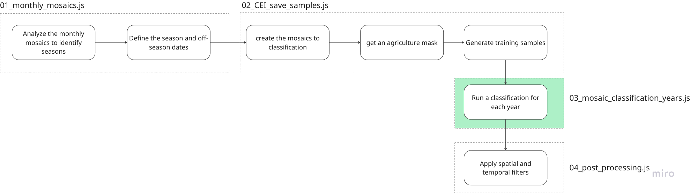

## Pipeline
This script demonstrates the crop classification pipeline, covering the following key steps:



> **Important**
\
The code is almost the same as `02_CEU_save_samples`but now you will run the classification for some years

> **Important**\
You have to create a ImageCollection inside the folder that you are using, to save the results
Example: 
\
`'projects/mapbiomas-india/assets/AGRICULTURE/crop_kenia'`

This will be your `outputCollection`

##User Settings
This section defines parameters that can be adjusted by the user, such as the target years for processing and seasonal definitions for crop analysis.

```javascript

// Defines an array of target years for which the classification will be performed.
var years = [2021, 2020, 2019, 2018, 2017, 2016, 2015, 2014, 2013, 2012]

// Iterates over each year in the 'years' array to perform classification for each year.
years.forEach(function (year) {

    // Defines seasonal configuration settings for the 'crop' type (e.g., PADDY).
    var settings_uf = {
        'crop': {
            uf: 'crop',
            offseason_startDate: (year - 1) + '-12-01', // Start date for the off-season.
            offseason_endDate: year + '-02-28', // End date for the off-season.
            season_startDate: year + '-03-01', // Start date for the growing season.
            season_endDate: year + '-05-30', // End date for the growing season.
            bands: ['cei_ndwi', 'swir1_offseason', 'swir2_offseason'], // Bands to be used in the final mosaic visualization.
        },
    };

```

##Main Processing Loop
The core logic of the script resides within a loop that iterates through each defined year and then through the `settings_uf` (currently only 'crop').

> **Important**
You have to change the `traning`variable to your own asset of samples, exported in the previously step

```javascript

// Process mosaic and classification for each defined key (in this case, just 'crop')
    for (var key in settings_uf) {
        // Ensures the property belongs to the object itself, not its prototype chain.
        if (settings_uf.hasOwnProperty(key)) {
            var state = settings_uf[key]; // Gets the current state/settings for the crop type.

            var centroid = scene.centroid(30) // Calculates the centroid of the scene geometry at 30m scale.

            // Loads Landsat collections (L5, L7, L8, L9) and filters them by the centroid and specific date ranges.
            var l5Collection = ee.ImageCollection(filterLandsatCollection("LANDSAT/LT05/C02/T1_TOA", centroid, "2000-01-01", "2011-10-01"));
            var l7Collection1 = ee.ImageCollection(filterLandsatCollection("LANDSAT/LE07/C02/T1_TOA", centroid, "2000-01-01", "2003-05-31"));
            var l7Collection2 = ee.ImageCollection(filterLandsatCollection("LANDSAT/LE07/C02/T1_TOA", centroid, "2011-10-01", "2013-03-01"));
            var l8Collection = ee.ImageCollection(filterLandsatCollection("LANDSAT/LC08/C02/T1_TOA", centroid, "2013-03-01", "2030-01-01"));
            var l9Collection = ee.ImageCollection(filterLandsatCollection("LANDSAT/LC09/C02/T1_TOA", centroid, "2019-03-01", "2030-01-01"));

            // Merges all filtered Landsat collections into a single collection.
            // Then, applies a series of mapping functions to each image in the collection:
            var collection = l8Collection.merge(l9Collection).merge(l7Collection1).merge(l7Collection2).merge(l5Collection)
                .map(padronizeBandNames) // Standardizes band names.
                .map(maskClouds) // Applies cloud and shadow masking.
                .map(getEVI2) // Computes and adds the EVI2 band.
                .map(getNDWI) // Computes and adds the NDWI band.


            // Extracts a part of the system:index property from the first image to use as a filename component.
            var filename = ee.String(collection.first().get('system:index')).split('_').get(4).getInfo()
            // print (filename) // Prints the extracted filename component (commented out).

            // Reads the seasonal and off-season start and end dates from the 'state' object.
            var season_startDate = state.season_startDate
            var season_endDate = state.season_endDate
            var offseason_startDate = state.offseason_startDate
            var offseason_endDate = state.offseason_endDate

            // print('season: ' + season_startDate + ' --- ' + season_endDate, 'offseason: ' + offseason_startDate + ' --- ' + offseason_endDate) // Prints season dates (commented out).

            // Generate seasonal and off-season mosaics
            // Generates the seasonal mosaic by filtering the collection by season dates and taking the quality mosaic based on EVI2.
            var season_mosaic = collection.filterDate(season_startDate, season_endDate).qualityMosaic('evi2')
            // Defines new names for the seasonal mosaic bands by appending "_season".
            var WetNewNames = season_mosaic.bandNames().map(function (band) {
                return ee.String(band).cat("_").cat('season')
            })
            season_mosaic = season_mosaic.rename(WetNewNames)

            // Generates the off-season mosaic by filtering the collection by off-season dates, bounding by the scene, and taking the minimum pixel value.
            var offseason_mosaic = collection.filterDate(offseason_startDate, offseason_endDate).filterBounds(scene).min()
            // Defines new names for the off-season mosaic bands by appending "_offseason".
            var DryNewNames = offseason_mosaic.bandNames().map(function (band) {
                return ee.String(band).cat("_").cat('offseason')
            })
            offseason_mosaic = offseason_mosaic.rename(DryNewNames)

            // Combine both mosaics into a single image
            var mosaic = season_mosaic.addBands(offseason_mosaic)

            // Compute CEI indicators for evi2 and ndwi
            // The formula uses "season" (seasonal index) and "offseason" (off-season index).
            var cei = mosaic.expression(
                '100*(season - offseason) / (100+season + 100+offseason)', {
                'season': mosaic.select(['evi2_season', 'ndwi_season']), // Selects seasonal EVI2 and NDWI.
                'offseason': mosaic.select(['evi2_offseason', 'ndwi_offseason']), // Selects off-season EVI2 and NDWI.
            }).rename(['cei_evi2', 'cei_ndwi']) // Renames the resulting bands to 'cei_evi2' and 'cei_ndwi'.

            // Adds the CEI bands to the main mosaic, unmasks all pixels, and clips to the scene geometry.
            mosaic = mosaic.addBands(cei).unmask().clip(scene)

            // Subset of mosaics for specific visualizations.
            var mosaic_CEI = mosaic.select(['cei_evi2', 'cei_ndwi']) // Selects only the CEI bands.
            var mosaic_season = mosaic.select(['evi2_season', 'ndwi_season']) // Selects only seasonal index bands.
            var mosaic_offseason = mosaic.select(['evi2_offseason', 'ndwi_offseason']) // Selects only off-season index bands.

            // Defines a band for visualization and a color palette.
            var band = 'ndwi' // Specifies 'ndwi' as the band to visualize.
            var palette = ['red', 'yellow', 'green'] // Defines a color palette for visualization.

            // Adds various layers to the Earth Engine map for visualization (all commented out by default).
            // Map.addLayer(mosaic, {},'mosaic all bands', false)
            // Map.addLayer(mosaic_offseason.select(band + '_offseason'), {min: 0, max:0.5, palette:palette},  band + '_offseason mosaic', false)
            // Map.addLayer(mosaic_season.select(band + '_season'), {min: 0, max:0.5, palette:palette},  band + '_season mosaic', false)
            // Map.addLayer(mosaic_CEI.select('cei_'+ band), {min: 0, max:0.2, palette: palette},  'CEI_' + band + ' mosaic', false)
            // Map.addLayer(mosaic.select(settings_uf[key].bands), {min:0, max: 0.3}, 'Mosaic')


            // Loads pre-existing training data from an Earth Engine asset for classification.
            var training = ee.FeatureCollection('projects/mapbiomas-india/assets/AGRICULTURE/SAMPLES_RICE_PADDY_crop')

            // Initializes and trains a Random Forest classifier with 100 trees.
            // It uses the loaded 'training' data, with 'class' as the dependent variable and all mosaic bands as predictors.
            var classifier = ee.Classifier
                .smileRandomForest(100)
                .train(training, 'class', mosaic.bandNames());

            // Applies the trained classifier to the 'mosaic' image to generate a classified image.
            var classified = mosaic.classify(classifier)
                .set('year', year) // Sets the 'year' property on the classified image for identification.
                .rename(['classification']); // Renames the output band to 'classification'.

            // Adds the classified image to the map, self-masking (showing only classified pixels),
            // with a red palette for class 1, and initially hidden.
            Map.addLayer(classified.selfMask(), { min: 1, max: 1, palette: 'red' }, 'classified_' + year, false)


            // Defines the output collection path for the classified image asset in Earth Engine.
            var outputCollection = 'projects/mapbiomas-india/assets/AGRICULTURE/crop_kenia'

            // Exports the classified image to an Earth Engine asset.
            Export.image.toAsset({
                image: classified.set('year', year), // The classified image to export, with the year property.
                description: 'RICE_' + key + '_' + year, // Description for the export task, including crop type and year.
                assetId: outputCollection + '/' + 'RICE_' + '_' + key + filename + '_' + year, // Full asset ID path for the exported image.
                region: scene, // The geographic region to export.
                scale: 30, // The resolution (pixel size) of the exported image in meters.
                maxPixels: 1.0E13 // Maximum number of pixels to allow in the export, preventing memory errors for large areas.
            });
        }
    }
}) 

```

##**Usage**
To use this script:

* Open the code (https://code.earthengine.google.com/c371bb1524303aad83e195cad3f9c498) Google Earth Engine Code Editor.

* Adjust the years array and scene geometry to your specific Area of Interest and desired years.

* Run the script.

* The classified results for each year will be displayed on the map.

* The classified images will be exported as Earth Engine assets under projects/mapbiomas-india/assets/AGRICULTURE/.


\

**Author**\
Kênia Santos\
kenia.mourao@remapgeo.com

**Version**\
MapBiomas \
Training India
\
\
\
Developed by [MapBiomas](https://brasil.mapbiomas.org/en/)  
