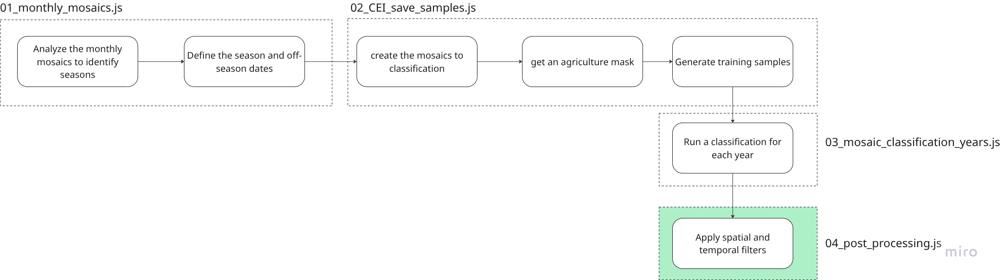
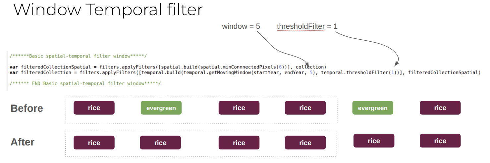
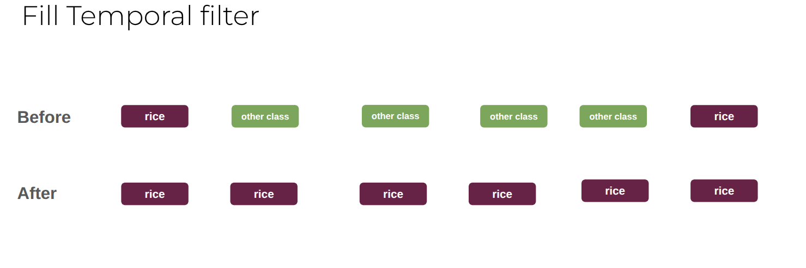
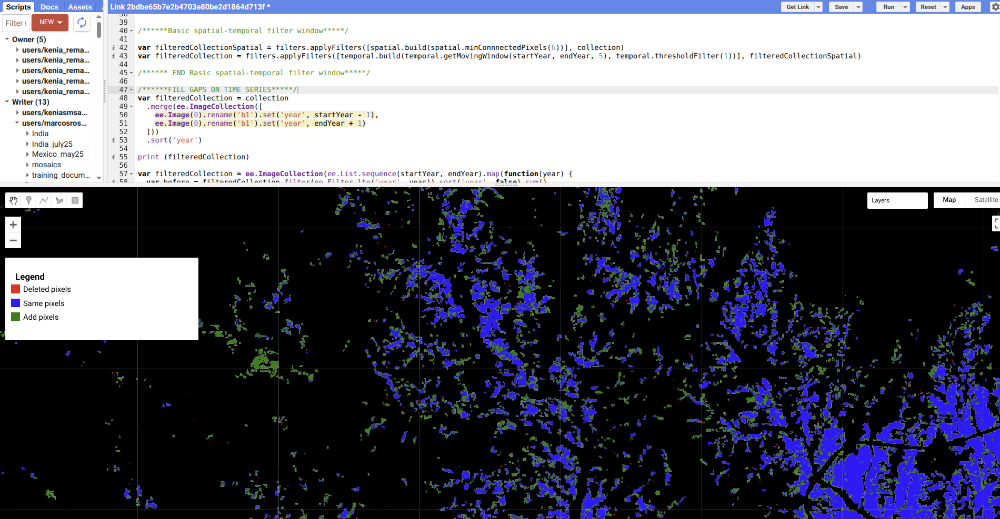

## Pipeline
This script demonstrates the crop classification pipeline, covering the following key steps:



# **Temporal Filters**

## Overview
This Google Earth Engine script is designed to apply spatial and temporal filters to a collection of classified agricultural images. Its main goal is to refine annual classification results, fill gaps in time series, and improve the overall accuracy and consistency of agricultural maps produced by the MapBiomas project. The script uses custom filter functions from a shared Earth Engine package.

## Objectives
* Load Classified Data: Ingest a collection of raw annual classification images.

* Harmonize Band Names: Ensure consistent band naming for processing.

* Apply Temporal Filters: Smooth the time series of classification, potentially filling gaps or removing short-lived anomalies.

* Apply Spatial Filters: Refine classification by removing small, isolated pixel clusters.

* Visualize Results: Compare raw and filtered classification outputs on the map.

* Export Filtered Data: Save the refined annual classification maps as Earth Engine image assets.

* Provide a Legend: Create an interactive legend on the map to explain the comparison visualization.

## External Modules
This script relies on a custom Earth Engine package that provides functions for spatial and temporal filtering. This package must be accessible in your Earth Engine environment.

```javascript
var filters = require("users/paulo_teixeira/packages:temporal_spatial_filters.js");
var temporal = filters.temporal; // Accesses functions for temporal filtering.
var spatial = filters.spatial;   // Accesses functions for spatial filtering.
```
\


## Data Ingestion and Initial Filtering
The script begins by loading a collection of raw annual classification images from a specified Earth Engine asset path. Each image in this collection is then cast to an 8-bit unsigned integer type (byte()) and its band is renamed to 'b1' for consistent processing. Additionally, the script filters out specific years from the collection if they are not needed for the analysis. The range of years in the processed collection is then determined and printed to the console.


```javascript
var collection = ee.ImageCollection('projects/mapbiomas-india/assets/AGRICULTURE/crop_kenia')
    .map(function (img) {
        return img.byte().rename('b1') // Converts image to byte type and renames the band to 'b1'.
    }).filter(ee.Filter.inList('year', [2001, 2002, 2003]).not()) // Excludes images from years 2001, 2002, and 2003.

print(collection.aggregate_array('year')) // Displays the list of years present in the filtered collection.

var years = ee.List([collection.aggregate_min('year'), collection.aggregate_max('year')]).getInfo() // Gets the minimum and maximum years from the collection.

var startYear = years[0] // Stores the earliest year in the collection.
var endYear = years[1]   // Stores the latest year in the collection.

print(years) // Displays the start and end years.
```

## Temporal and Spatial Filtering Pipeline
This section implements the core filtering logic. Two main approaches are presented, with one commented out. The active method focuses on filling gaps and ensuring temporal consistency in the classification time series.

Basic Spatial-Temporal Filter Window (Commented Out)
This commented-out section provides an alternative method for applying filters. It first applies a spatial filter to remove isolated pixels and then a temporal filter using a moving window. This approach is useful for general smoothing.

```javascript
/******Basic spatial-temporal filter window*****/
 
var filteredCollectionSpatial = filters.applyFilters([spatial.build(spatial.minConnnectedPixels(6))], collection) // Applies a spatial filter to remove isolated pixels (minimum 6 connected pixels).
var filteredCollection = filters.applyFilters([temporal.build(temporal.getMovingWindow(startYear, endYear, 5), temporal.thresholdFilter(1))], filteredCollectionSpatial) // Applies a temporal filter using a 5-year moving window and a threshold.

/****** END Basic spatial-temporal filter window*****/
```

Logic:




>**Importat**\
You can change the window and the threshold to obtain other results


## Fill Gaps on Time Series 
It focuses on filling temporal gaps and ensuring consistency within the annual classification time series.
 > **Important**\
 Only use this filter to perennial classes, like perennial crop and forest plantation

 ```javascript
 /******FILL GAPS ON TIME SERIES*****/
// Merges the collection with placeholder images for years immediately before the start and after the end of the time series.
// This ensures that the temporal filter has context at the boundaries of the data.
var filteredCollection = collection
    .merge(ee.ImageCollection([
        ee.Image(0).rename('b1').set('year', startYear - 1), // Placeholder for the year before the start.
        ee.Image(0).rename('b1').set('year', endYear + 1)   // Placeholder for the year after the end.
    ]))
    .sort('year') // Sorts the combined collection by year.

print(filteredCollection) // Displays the collection, including the added placeholder images.

// Applies a temporal gap-filling logic. For each year in the sequence, it checks if a pixel was classified (value 1)
// by considering its state in the current year, and its classification in preceding and succeeding years.
var filteredCollection = ee.ImageCollection(ee.List.sequence(startYear, endYear).map(function (year) {
    // Sums classifications from years less than or equal to the current year, sorted in descending order.
    var before = filteredCollection.filter(ee.Filter.lte('year', year)).sort('year', false).sum()
    // Gets the classification for the current year, unmasking any masked pixels.
    var thisYear = filteredCollection.filter(ee.Filter.eq('year', year)).first().unmask()
    // Sums classifications from years greater than or equal to the current year, sorted in ascending order.
    var after = filteredCollection.filter(ee.Filter.gte('year', year)).sort('year', true).sum()

    // Applies a logical OR operation: a pixel is classified if it's classified in 'thisYear' OR
    // if it was classified in a 'before' year AND in an 'after' year (indicating temporal consistency).
    return thisYear.or(before.and(after)).set('year', year)
}))
    .sort('year') // Sorts the resulting collection by year.

// Applies a spatial filter to the temporally processed collection, removing isolated pixels.
// It keeps only connected pixel groups of 6 or more.
var filteredCollection = filters.applyFilters([spatial.build(spatial.minConnnectedPixels(6))], filteredCollection)

/****** END FILL GAPS ON TIME SERIES*****/

```



## Data Transformation and Visualization
This section prepares both the raw and filtered image collections for visualization and comparison on the Earth Engine map.

`toBandsByYear`

This helper function transforms an `ImageCollection` (where each image represents a classification for a specific year) into a single multi-band `Image`. Each band in the output image corresponds to a year, with band names formatted as 'bYYYY' (e.g., 'b2021'). This format is useful for displaying and comparing annual classifications side-by-side.

```javascript

function toBandsByYear(collection) {
    var years = collection.aggregate_array('year'); // Retrieves an array of all unique years from the collection.

    // Generates new band names by prepending 'b' to each year (e.g., 2021 becomes 'b2021').
    var newNames = years.map(function (year) {
        return ee.String('b').cat(ee.String(ee.Number(year).int()));
    });

    return ee.ImageCollection(collection).toBands().rename(newNames); // Converts the ImageCollection into a single multi-band image and renames the bands.
}

var raw_img = toBandsByYear(collection).byte() // Converts the raw annual classification collection into a single multi-band image (byte type).
var filtered_img = toBandsByYear(filteredCollection).byte() // Converts the filtered annual classification collection into a single multi-band image (byte type).

var region = raw_img.geometry() // Extracts the geographic boundary (geometry) from the raw image, which represents the overall study area.
Map.addLayer(region) // Adds this region boundary as a layer on the Earth Engine map for context.


var year = 2021 // Sets a specific year (e.g., 2021) to be visualized on the map.

var vis = { bands: ['b' + year], min: 0, max: 1 } // Defines visualization parameters: selects the band corresponding to the chosen year ('b2021'), with pixel values ranging from 0 to 1.
Map.addLayer(raw_img, vis, 'raw ' + year) // Adds the raw classification image for the selected year to the map.
Map.addLayer(filtered_img, vis, 'filtered ' + year) // Adds the filtered classification image for the selected year to the map.

print(vis['bands'][0]) // Prints the name of the band being visualized (e.g., 'b2021') to the console.

// Creates a difference image to visually compare the raw and filtered classifications for the selected year.
// This remapping assigns new values to pixels based on their classification status in both images:
// - Pixels that are 1 (classified) in the raw image but 0 (not classified) in the filtered image become 2 (recolored red).
// - Pixels that are 1 in both raw and filtered images become 3 (recolored blue).
// - Pixels that are 0 in the raw image but 1 in the filtered image become 1 (recolored green).
var diff = raw_img.select(vis['bands'][0]).remap([1], [2]).unmask().add(filtered_img.select(vis['bands'][0]).unmask())
// Adds the comparison layer to the map, self-masking to show only the remapped pixels, with a custom color palette.
Map.addLayer(diff.selfMask(), { min: 1, max: 3, palette: ['green', 'red', 'blue'] }, 'comparision before and after filter ' + year)

```



## Export Filtered Image
The final filtered multi-band image, containing the refined annual classifications, is exported as a new Earth Engine asset. This allows for persistent storage and use in other analyses or applications.

```javascript

var outputCollection = 'projects/mapbiomas-india/assets/AGRICULTURE/crop_kenia' // Defines the Earth Engine asset path where the output image will be stored.
var version = '1' // Sets a version identifier for the exported asset.

Export.image.toAsset({
    image: filtered_img.set('type', 'filtered').set('version', version), // Specifies the filtered image to export and adds metadata properties ('type' and 'version').
    description: 'RICE_Fitlered' + version, // Provides a description for the export task, visible in the Earth Engine Tasks tab.
    assetId: outputCollection + '/' + 'RICE_Fitlered' + version, // Constructs the full asset ID path for the exported image.
    region: region, // Defines the geographic region to be exported, using the geometry derived from the input data.
    scale: 30, // Sets the spatial resolution (pixel size) of the exported image to 30 meters.
    maxPixels: 1.0E13 // Sets the maximum number of pixels allowed in the export, preventing memory errors for large areas.
});

```

## Legend Creation
This section creates an interactive User Interface (UI) panel on the Earth Engine map. This panel serves as a legend to explain the colors used in the "comparison before and after filter" visualization layer.

```javascript

/*
====================================

        Create Legend

=====================================
*/

// Creates the main UI panel that will contain the legend elements.
var toolPanel = ui.Panel({
    widgets: [ui.Label('')], // Initializes with an empty label.
    layout: ui.Panel.Layout.flow("vertical"), // Arranges child widgets vertically.
    style: {
        width: "350px",   // Sets the width of the legend panel.
        height: "150px",  // Sets the height of the legend panel.
        margin: '2px"',   // Sets the margin around the panel.
        padding: '10px',  // Sets the internal padding of the panel.
        position: 'top-left', // Positions the panel at the top-left corner of the map.
    }
});

// Creates a sub-panel specifically for the legend items, with custom styling for text.
var legendPanel = ui.Panel({
    style: { fontWeight: 'bold', fontSize: '10px', margin: '0 0 0 8px', padding: '0' }
});
toolPanel.add(legendPanel); // Adds the legend items panel to the main tool panel.

// Creates a title for the legend.
var legendTitle = ui.Label(
    'Legend',
    { fontWeight: 'bold', fontSize: '16px', margin: '0 0 4px 0', padding: '0' });
legendPanel.add(legendTitle); // Adds the legend title to the legend items panel.

// Defines a helper function to create a single row in the legend, consisting of a colored box and a descriptive label.
var makeRow = function (color, name) {
    // Creates a UI Label that acts as the colored box.
    var colorBox = ui.Label({
        style: {
            backgroundColor: color, // Sets the background color of the box.
            padding: '8px',         // Adds padding to give the box height and width.
            margin: '0 0 4px 0'      // Sets the margin below the color box.
        }
    });

    // Creates a UI Label to display the description text for the colored box.
    var description = ui.Label({
        value: name,                // The text description (e.g., 'Deleted pixels').
        style: { margin: '0 0 8px 6px' } // Sets the margin around the description text.
    });

    // Returns a horizontal UI Panel containing both the colored box and its description.
    return ui.Panel({
        widgets: [colorBox, description],
        layout: ui.Panel.Layout.Flow('horizontal') // Arranges widgets horizontally within the row.
    });
};

// Adds individual legend rows to the main tool panel, explaining the colors in the comparison layer.
toolPanel.add(makeRow('red', 'Deleted pixels')) // Red: Pixels that were classified in the raw image but removed by the filter.
toolPanel.add(makeRow('blue', 'Same pixels'))   // Blue: Pixels that were classified consistently in both raw and filtered images.
toolPanel.add(makeRow('green', 'Added pixels')) // Green: Pixels that were not classified in the raw image but were added by the filter (e.g., gap-filled).
Map.add(toolPanel) // Adds the entire legend UI panel to the Earth Engine map.

```

## Usage
To use this script:

* Open the Google Earth Engine Code Editor (https://code.earthengine.google.com/8bc03ad0f205ba8c818fc542768cbb40).
* Ensure the users/paulo_teixeira/packages:temporal_spatial_filters.js module is accessible in your Earth Engine environment. This is a crucial dependency for the filtering functions.

* Adjust the years array at the beginning of the script to specify the range of years you want to process.

* Modify the year variable in the "Data Transformation and Visualization" section to change which specific year's raw, filtered, and comparison layers are displayed on the map.

* Run the script.

* The raw, filtered, and comparison layers will be displayed on the map, along with an interactive legend explaining the comparison colors.

* The final filtered image collection will be exported as a multi-band asset to projects/mapbiomas-india/assets/AGRICULTURE/crop_kenia/RICE_Fitlered1. You can monitor the export task in the "Tasks" tab of the Earth Engine Code Editor.

\

**Author**\
Kênia Santos\
kenia.mourao@remapgeo.com

**Version**\
MapBiomas \
Training India
\
\
\
Developed by [MapBiomas](https://brasil.mapbiomas.org/en/)  