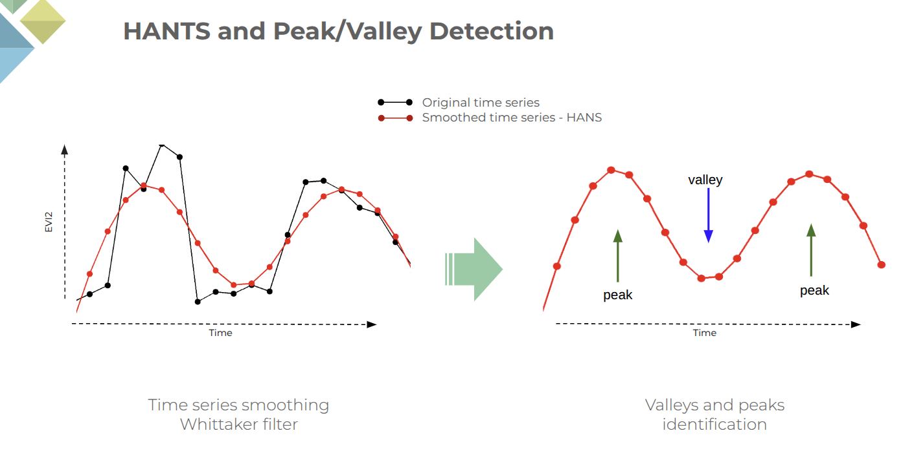
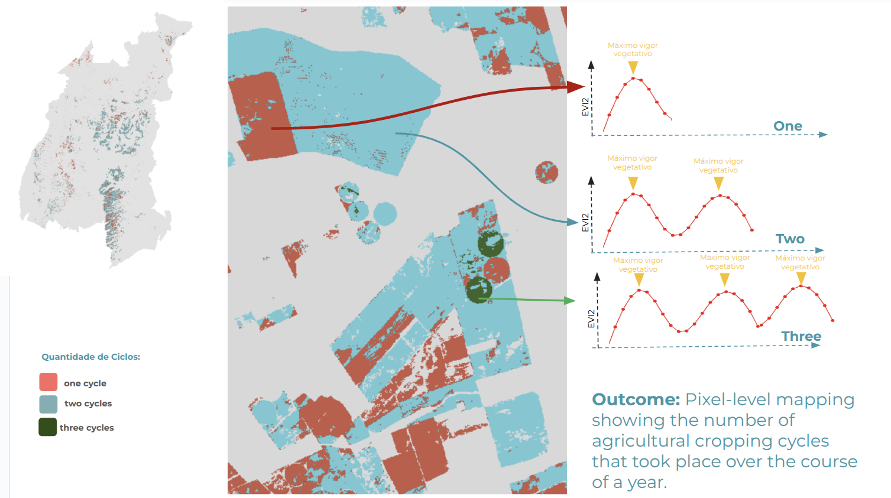

## **HANTS and Peak/Valley Detection**

### Overview
This Google Earth Engine script uses the Harmonic Analysis of NDVI Time Series (HANTS) algorithm to smooth a time series of Sentinel-2 data. Its primary function is to detect and count the number of agricultural growing seasons (or "peaks") within a defined year and spatial grid. The result is a frequency map of agricultural activity, which is then exported as an Earth Engine asset.

The script is a valuable tool for monitoring multi-cropping patterns and understanding agricultural dynamics over time.



## Objectives
* Load External Modules: Import a custom hants package to smooth time series data.

* Define Peak/Valley Detection: Use a custom function to identify peaks and valleys in the smoothed time series, which correspond to changes in vegetation health.

* Process Spatial Grid: Iterate through a predefined grid of Sentinel-2 tiles to process each one individually.

* Filter and Prepare Imagery: Load Sentinel-2 imagery, filter it by location and date, and compute the EVI2 index for each image.

* Apply HANTS Algorithm: Smooth the EVI2 time series to remove noise and gaps.

* Count Peaks: Count the number of detected peaks within a defined time frame for each pixel, representing the number of growing seasons.

* Export Results: Export the final "number of peaks" raster as a new Earth Engine asset.

## External Modules
The script imports a user-contributed package that contains the HANTS algorithm, which is a powerful tool for time-series analysis in Earth Engine.


```javascript
var hants = require('users/paulo_teixeira/packages:hants.js').hants
```


## Peak and Valley Detection Logic
This custom function, detectPeaksAndValleys, is the core of the script's analytical power. It analyzes an image time series (an ee.ImageCollection) to identify peaks and valleys, which correspond to periods of maximum and minimum vegetation cover. The logic works by comparing each data point to its neighbors.

## Key Steps:
1. Preparation: The function first converts the ImageCollection into a single multi-band image, where each band represents a date. This multi-band image is then converted into an array for efficient mathematical operations.

2. Difference Calculation: It computes the difference between each data point and its next and previous neighbors.

3. Peak/Valley Identification: It identifies peaks (where a point is greater than both its neighbors) and valleys (where a point is smaller than both its neighbors) based on these differences.

4. Value Filtering: The function then filters these detected peaks and valleys based on user-defined parameters (min_difference and min_peak) to ensure that only significant changes in the time series are considered. This helps to filter out small fluctuations or noise.

5. Return Filtered Dates: Finally, it returns an image collection where each image represents a detected peak, containing the date of that peak.

```javascript
// function to get the position of the valleys in a time-series
var detectPeaksAndValleys = function(col, min_difference, min_peak) {
  // Function logic as described above.
  ...
}
```

## Script Inputs
This section defines the key parameters and data sources for the script, which you can easily modify.

* `sentinel_grid`: A FeatureCollection of Sentinel-2 tiles, used to process data in manageable chunks.

* `output_path`: The Earth Engine asset path where the final results will be saved. You have to change for your own `imageCollection`

* `years`: An array of target years to process.

* `min_difference`: The minimum required difference between a peak and its neighboring valleys. This is a crucial parameter for filtering out noise.

* `min_peak`: The minimum value a pixel must have to be considered a peak.

* `integration`: A pre-existing mask of agricultural areas (in this case, from MapBiomas Collection 9) used to focus the analysis only on relevant land covers.

```javascript
// >>>>>>>>>>>>>>>>>>>>>>>>>>>>>>>>>>>>>>>>>>>>>>>>>>>>>>>>>>>>>>>>>>>>>>>>>>>>>>>>>>>>>>>>>>>>>>>>>>>>>>
//                                             INPUTS
// >>>>>>>>>>>>>>>>>>>>>>>>>>>>>>>>>>>>>>>>>>>>>>>>>>>>>>>>>>>>>>>>>>>>>>>>>>>>>>>>>>>>>>>>>>>>>>>>>>>>>>

var sentinel_grid = ee.FeatureCollection('projects/mapbiomas-remap/assets/REGIONS/grid_sentinel_agri')
  .filter(ee.Filter.inList('NAME', ['21LXG']))

var version = 1

// select your output ImageCollection
var output_path = 'projects/mapbiomas-remap/assets/MODULO_AGRICULTURA/FREQUENCIA/frequency_scenes_C10'

// select target years
var years = [2023]

// cycle detection parameters
var min_difference = 0.7
var min_peak = 1

var priority = 100

// agriculture mask - you can use mapbiomas LULC mask
var integration = ee.Image('projects/mapbiomas-public/assets/brazil/lulc/collection9/mapbiomas_collection90_integration_v1')
  .select('classification_' + years[0])
  .remap([39, 41, 40, 20, 62], [99, 99, 99, 99, 99]) // Classes of crop (39: soybean, 41: other temporary crop, 40: rice, 62: cotton)
  .eq(99)
```


## Main Processing Loop
This is the main part of the script, where the processing pipeline is executed for each tile in the sentinel_grid and for each year specified in the years array.

1. Check for Completed Scenes: The script first checks if a specific tile (scene) for a given year has already been processed to avoid redundant computations.

2. Load and Prepare Sentinel-2 Data: It loads the Sentinel-2 Level-2A surface reflectance data, filters it by the tile's geometry and a buffer date range, and calculates the EVI2 index for each image.

3. Apply HANTS: The hants function is applied to the EVI2 time series to generate a smoothed curve (fitted).

4. Detect Peaks: The detectPeaksAndValleys function is then called on the smoothed time series to identify peaks.

5. Count Peaks: The number of detected peaks within the main date range is counted for each pixel, creating a final frequency image. This image is masked by the integration layer to focus only on agricultural areas.

6. Visualize and Export: The final frequency image is added to the map for visual inspection and then exported to the predefined Earth Engine asset path.

```javascript
// >>>>>>>>>>>>>>>>>>>>>>>>>>>>>>>>>>>>>>>>>>>>>>>>>>>>>>>>>>>>>>>>>>>>>>>>>>>>>>>>>>>>>>>>>>>>>>>>>>>>>>
//                                        LOOP FOR YEARS AND OP
// >>>>>>>>>>>>>>>>>>>>>>>>>>>>>>>>>>>>>>>>>>>>>>>>>>>>>>>>>>>>>>>>>>>>>>>>>>>>>>>>>>>>>>>>>>>>>>>>>>>>>>

years.forEach(function(year){
  // Checks for and removes already processed scenes.
  var done_scenes = ee.ImageCollection(output_path)
    .filter(ee.Filter.eq('version', version))
    .filter(ee.Filter.eq('year', year))
    .aggregate_array('scene')
    
  var op = sentinel_grid.aggregate_array('NAME').removeAll(done_scenes).getInfo()
  print(op)

  op.forEach(function(pathrow){
    // Defines the tile geometry and date range.
    var tile = sentinel_grid.filter(ee.Filter.eq("NAME", pathrow)).first()
    var roi = tile.geometry()
    
    // Loads Sentinel-2 collection and calculates EVI2.
    var full_collection = ee.ImageCollection("COPERNICUS/S2_SR_HARMONIZED")
      .filter(ee.Filter.and(
        ee.Filter.bounds(roi),
        ee.Filter.eq('MGRS_TILE', pathrow),
        ee.Filter.date(buffer_start_date, buffer_end_date)
      ))
      .map(function(image){
        return image.addBands(image.expression('2.5 * ((NIR - RED) / (NIR + 2.4*RED + 1))', {
          'NIR': image.select('B8'),
          'RED': image.select('B4')
        }).rename('EVI2')).unmask(0, false)
      })
      .select(['EVI2'])
    
    // Applies HANTS and detects peaks/valleys.
    ...
    var harmonizedCollection = hants(collection,harmonics,fet,hilo,newOut,coeficient,dod,maxIter, 'EVI2')
    var inflexions = detectPeaksAndValleys(harmonizedCollection.select('fitted'), min_difference, min_peak)
    var peak_img = inflexions.select('peak')

    // Counts the number of peaks (growing seasons).
    var n_peaks = peak_img
      .map(function(img){
        return img.updateMask( img.gte(ee.Image.constant(startDate.millis())).and(img.lte(ee.Image.constant(endDate.millis()))) )
      })
      .reduce(ee.Reducer.countDistinctNonNull())
      .updateMask(integration)
      
    // Sets metadata, adds layer to map, and exports the final image.
    ...
    Export.image.toAsset({
      image: out.selfMask(),
      description: 'remap_AGRI_FREQ_'+filename,
      assetId: output_path+'/'+filename,
      region: roi,
      scale: 10,
      maxPixels: 1e13,
      priority: priority
    })
  })
})
```
## Example of result


## **Usage**
To use this script:

1. Open the Google Earth Engine Code Editor.

2. Copy and paste the entire script into a new script file.

3. Ensure the users/paulo_teixeira/packages:hants.js module is accessible in your Earth Engine environment.

4. Adjust the sentinel_grid and years variables to match your specific study area and time period.

5. Set the min_difference and min_peak parameters to fine-tune the peak detection sensitivity.

6. Modify the integration mask to align with your definition of agricultural areas.

7. Run the script.

The final frequency maps will be displayed on the map and exported to your specified asset path.

YOU CAN ACESS THE FULL CODE HERE:\
https://code.earthengine.google.com/87029c7efa64908544cb2273e670987e

---

## Contact

Developed by\
 [MapBiomas](https://brasil.mapbiomas.org/en/)  

Author: \
Kenia Mourão – kenia.mourao@remapgeo.com\
Paulo Teixeira - paulo.teixeira@remapgeo.com


Version\
MapBiomas Brazil Collection 10