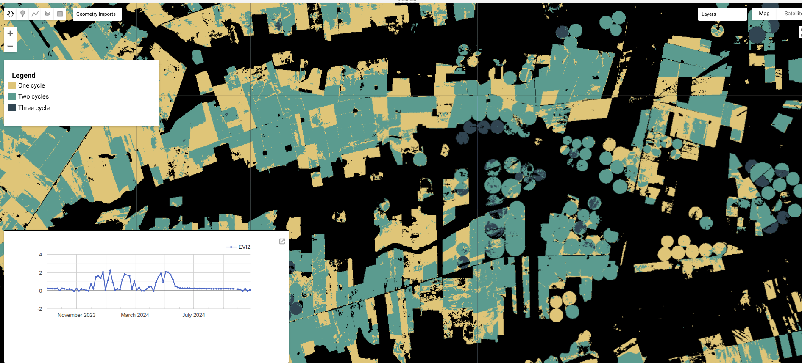

# MapBiomas Frequency Analysis and Visualization
## **Overview**
This Google Earth Engine script is designed to process a collection of agricultural "frequency" images, calculating both annual and long-term mean frequencies of crop cycles. The script then visualizes the results on the map, allowing for an interactive exploration of agricultural dynamics through an on-click time series chart. Finally, it exports the annual and mean frequency maps as new Earth Engine assets.

## Objectives
* Load and Filter Data: Ingest a collection of pre-processed frequency images and an agricultural mask, filtering them by year.

* Calculate Annual Frequency: Create a multi-band image where each band represents the annual frequency of crop cycles for a given year.

* Calculate Mean Frequency: Compute the average frequency of crop cycles over a specified time period.

* Visualize Results: Add the frequency maps to the Earth Engine viewer, including a custom color palette.

* Create Interactive UI: Implement an on-click event to generate a time series chart of EVI2 for any point on the map.

* Export Assets: Export the final annual and mean frequency images as new Earth Engine assets.

## Data Ingestion and Preparation
The script begins by loading a predefined grid of Sentinel-2 tiles and an ImageCollection of raw frequency scenes. It also loads a classification mask from MapBiomas Collection 9 to focus the analysis only on agricultural areas.

```javascript
var sentinel_grid = ee.FeatureCollection('projects/mapbiomas-remap/assets/REGIONS/grid_sentinel_agri')
Map.addLayer(sentinel_grid, {}, 'grid', false)

var integration = ee.ImageCollection('projects/mapbiomas-workspace/COLECAO9-S2/integracao').filter(ee.Filter.eq('version', '0-3')).mosaic().eq(19)
integration = integration.addBands(integration.select(['classification_2023'],['classification_2024']))

var frequency_scenes = ee.ImageCollection('projects/mapbiomas-remap/assets/MODULO_AGRICULTURA/FREQUENCIA/frequency_scenes_C10')
print (frequency_scenes.aggregate_array('year').distinct())
```

## Frequency Calculation
This section processes the loaded data to create two main outputs: an annual frequency map and a mean frequency map.

### Annual Frequency
The script iterates through a list of target years (2024 in this case) and, for each year, creates a single-band image representing the maximum frequency count from all available frequency scenes. This image is then masked to show only agricultural areas and remapped to consolidate categories. The resulting images are combined into a single multi-band Image for easy visualization and export.

```javascript
var years = ee.List.sequence(2024, 2024)

var names = years.map(function(year){ return ee.String('b').cat(ee.String(ee.Number(year).int())) })

var freq_col = ee.ImageCollection(years.map(function(year){
  
  var mask = integration.select(ee.String('classification_').cat(ee.Number(year).int()))
  
  var img = ee.ImageCollection(frequency_scenes
    .filter(ee.Filter.inList('version',[1,4,5,7]))
    .filter(ee.Filter.eq('year', year))
    .sort('version', false)
    .distinct('scene'))
    .max()
    .updateMask(mask)
    .remap([1,2,3,4], [1,2,3,3])
  
  return img.set('year', year)

}))

var freq_img = freq_col.toBands().rename(names)
```

## Mean Frequency
The script also calculates the mean frequency of crop cycles over a specified period. This is useful for identifying areas with consistent multi-cropping activity over time.

```javascript

var periods = [
  [2024, 2024]  
]

var periods_names = periods.map(function(period){
  period = ee.List(period)
  return ee.String('p').cat(ee.String(ee.Number(period.get(0)).int())).cat('_').cat(ee.String(ee.Number(period.get(1)).int()))
})

var freq_mean = ee.ImageCollection(ee.List(periods).map(function(period){
  period = ee.List(period)
  var col = freq_col.filter(ee.Filter.rangeContains('year', period.get(0), period.get(1)))
  var mean = col.reduce(ee.Reducer.mean())
  return mean
})).toBands().rename(periods_names)

var interval = 0.5
var freq_mean_categorized = freq_mean.expression(
  '(floor(value / interval) + (value % interval > 0 ? 1 : 0)) * interval',
  {
    'value': freq_mean,
    'interval': interval
  });
```

## Frequency Calculation
This section processes the loaded data to create two main outputs: an annual frequency map and a mean frequency map.

### Annual Frequency
The script iterates through a list of target years (2024 in this case) and, for each year, creates a single-band image representing the maximum frequency count from all available frequency scenes. This image is then masked to show only agricultural areas and remapped to consolidate categories. The resulting images are combined into a single multi-band Image for easy visualization and export.

```javascript
var years = ee.List.sequence(2024, 2024)

var names = years.map(function(year){ return ee.String('b').cat(ee.String(ee.Number(year).int())) })

var freq_col = ee.ImageCollection(years.map(function(year){
  
  var mask = integration.select(ee.String('classification_').cat(ee.Number(year).int()))
  
  var img = ee.ImageCollection(frequency_scenes
    .filter(ee.Filter.inList('version',[1,4,5,7]))
    .filter(ee.Filter.eq('year', year))
    .sort('version', false)
    .distinct('scene'))
    .max()
    .updateMask(mask)
    .remap([1,2,3,4], [1,2,3,3])
  
  return img.set('year', year)

}))

var freq_img = freq_col.toBands().rename(names)
```

### Mean Frequency
The script also calculates the mean frequency of crop cycles over a specified period. This is useful for identifying areas with consistent multi-cropping activity over time.

```javascript
var periods = [
  [2024, 2024]  
]

var periods_names = periods.map(function(period){
  period = ee.List(period)
  return ee.String('p').cat(ee.String(ee.Number(period.get(0)).int())).cat('_').cat(ee.String(ee.Number(period.get(1)).int()))
})

var freq_mean = ee.ImageCollection(ee.List(periods).map(function(period){
  period = ee.List(period)
  var col = freq_col.filter(ee.Filter.rangeContains('year', period.get(0), period.get(1)))
  var mean = col.reduce(ee.Reducer.mean())
  return mean
})).toBands().rename(periods_names)

var interval = 0.5
var freq_mean_categorized = freq_mean.expression(
  '(floor(value / interval) + (value % interval > 0 ? 1 : 0)) * interval',
  {
    'value': freq_mean,
    'interval': interval
  });
```

## Data Export
The final annual and mean frequency images are exported as new Earth Engine assets, with a detailed metadata dictionary attached to each. This makes the data easily discoverable and usable in other projects.

```javascript
var metadata = {
      version: '1',
      collection: 10.0,
      theme: 'AGRICULTURA',
      territory : 'BRAZIL',
      biome : null,
      source: 'remap',
      year: year,
      description: 'versão 1 da Coleção 10 do mapa de número de ciclos do módulo agricultura'
    };


var filename = 'freq_anual_'+metadata['version']
Export.image.toAsset({
  image: freq_img.set(metadata),
  description: filename,
  assetId: 'projects/mapbiomas-brazil/assets/LAND-COVER/COLLECTION-10/AGRICULTURE/number-of-cycles/'+filename,
  region: geometry,
  scale: 10,
  maxPixels: 1e13
})

var filename = 'freq_media_'+metadata['version']
Export.image.toAsset({
  image: freq_mean.set(metadata),
  description: filename,
  assetId: 'projects/mapbiomas-brazil/assets/LAND-COVER/COLLECTION-10/AGRICULTURE/number-of-cycles-mean/'+filename,
  region: geometry,
  scale: 10,
  maxPixels: 1e13
})
```

## Visualization and Interactive Chart
The script adds the processed frequency map to the Earth Engine viewer with a custom color palette. It also creates a UI panel that displays a time series chart of EVI2 values for any pixel clicked on the map, providing a powerful way to validate the classification results.


```javascript
var Titulo = ui.Label("CLIQUE NO MAPA PARA VER A SÉRIE TEMPORAL", {});

var panel = ui.Panel({
  widgets: [Titulo],
  layout: ui.Panel.Layout.flow("horizontal"),
  style: {
    "position": 'bottom-left',
    "width": "35%",
    "min-height": "300px",
    "border": '0.5px solid #000000',
  }
});

var currentPoint = null;
Map.onClick(function(latlong){
  panel.clear();
  currentPoint = ee.Geometry.Point([latlong.lon, latlong.lat]);
  
  var full_collection = ee.ImageCollection("COPERNICUS/S2_SR_HARMONIZED")
    .filter(ee.Filter.date((year-1)+'-09-01', year+'-10-30'))
    .filterBounds(currentPoint)
    .map(function(image){
      return image.addBands(image.expression('2.5 * ((NIR - RED) / (NIR + 2.4*RED + 1))', {
        'NIR': image.select('B8'),
        'RED': image.select('B4')
      }).rename('EVI2')).unmask(0, false)
    })
    .select(['EVI2'])
  
  var chart = ui.Chart.image.series(full_collection.select(["EVI2"])
    , currentPoint, ee.Reducer.median(), 30)
  chart.setChartType('LineChart')
  chart.setOptions({
    windth: true,
    interpolateNulls: true,
    series: {
      0: {lineWidth: 2, pointSize: 2 },
    }})
  chart.style().set({
    "width": '99%',
    "max-width": '100%',
    "max-height": '300px'
  });
  panel.add(chart);
  
  });

Map.add(panel);
```

## Example of results


## **Usage**

To use this script:

1. Open the Google Earth Engine Code Editor.

2. Copy and paste the entire script into a new script file.

3. Adjust the years and periods variables to match your specific study area and time frame.

4. Ensure that the asset paths for sentinel_grid, integration, and frequency_scenes are correct and accessible in your Earth Engine account.

5. Run the script.

6. The processed frequency maps will be displayed on the map.

7. The annual and mean frequency images will be exported as assets to the paths specified in the Export.image.toAsset calls.

---
YOU CAN ACESS THE FULL CODE HERE:\
https://code.earthengine.google.com/75e2c9f48429aed0ca6ec869a0d51211 

---

## Contact

Developed by\
 [MapBiomas](https://brasil.mapbiomas.org/en/)  

Author: \
Kenia Mourão – kenia.mourao@remapgeo.com\
Paulo Teixeira - paulo.teixeira@remapgeo.com


Version\
MapBiomas Brazil Collection 10