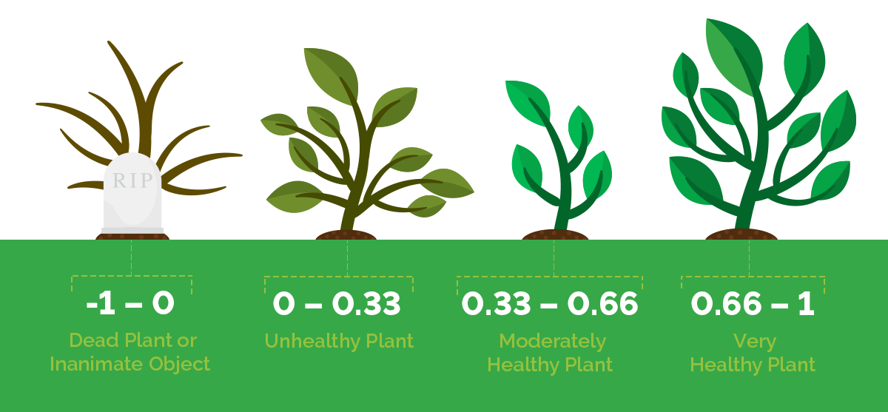

# Class 2 - Accessing Satellite Images and Creating Mosaics

# Concepts

**Image Collection**: As straightforward as it could be, it is a collection of images. You may think of it as a pile of images. The Z-axis represents time, X-axis and Y-axis represent the Earth's surface.

<p align="center">
    
</p>

**Mosaic**: A mosaic is a combination or merging of two or more images. Any given mosaic can be a multiband or single-band mosaic. The MapBiomas project works with the concept of multiband mosaics.

<p align="center">
    
</p>

**Landsat Bit Values**: The Landsat satellites are a family of distinct satellite missions. Each family has its digital characteristics, one of which is the 'bit value' QA Bands. The bit values are a digital parameters that can be used to group out specific pixel characteristics. The QA Bit Values will group the Landsat pixels as belonging to.
_Note_: Numerically speaking, any number in our screen is originally a binary number (0 or 1).

### Landsat Surface Reflectance-Derived Spectral Indices Pixel Quality Band: Landsat 8

| **Bit Position** | **Description**                  | **Values**                                                                                                                                      | **Bit Combinations (Binary)** | **Decimal Equivalent** |
|-------------------|----------------------------------|------------------------------------------------------------------------------------------------------------------------------------------------|--------------------------------|-------------------------|
| **0**            | *Fill*                          | Identifies fill pixels (no valid data).                                                                                                        | `0`, `1`                      | 0, 1                   |
| **1**            | *Dilated Cloud*                 | Indicates presence of dilated clouds (buffered clouds).                                                                                        | `0`, `1`                      | 0, 1                   |
| **2**            | *Cirrus (high confidence)*      | Indicates presence of high-confidence cirrus clouds.                                                                                           | `0`, `1`                      | 0, 1                   |
| **3**            | *Cloud*                         | Identifies presence of regular clouds.                                                                                                         | `0`, `1`                      | 0, 1                   |
| **4**            | *Cloud Shadow*                  | Indicates presence of cloud shadows.                                                                                                           | `0`, `1`                      | 0, 1                   |
| **5**            | *Snow*                          | Indicates presence of snow.                                                                                                                    | `0`, `1`                      | 0, 1                   |
| **6**            | *Clear*                         | `0`: Clouds (Cloud or Dilated Cloud bits are set). <br> `1`: Clear (Cloud and Dilated Cloud bits are not set).                                 | `0`, `1`                      | 0, 1                   |
| **7**            | *Water*                         | Indicates water pixels.                                                                                                                        | `0`, `1`                      | 0, 1                   |
| **8-9**          | *Cloud Confidence*              | `00`: None <br> `01`: Low confidence <br> `10`: Medium confidence <br> `11`: High confidence.                                                  | `00`, `01`, `10`, `11`        | 0, 1, 2, 3            |
| **10-11**        | *Cloud Shadow Confidence*       | `00`: None <br> `01`: Low confidence <br> `10`: Medium confidence <br> `11`: High confidence.                                                  | `00`, `01`, `10`, `11`        | 0, 1, 2, 3            |
| **12-13**        | *Snow/Ice Confidence*           | `00`: None <br> `01`: Low confidence <br> `10`: Medium confidence <br> `11`: High confidence.                                                  | `00`, `01`, `10`, `11`        | 0, 1, 2, 3            |
| **14-15**        | *Cirrus Confidence*             | `00`: None <br> `01`: Low confidence <br> `10`: Medium confidence <br> `11`: High confidence.                                                  | `00`, `01`, `10`, `11`        | 0, 1, 2, 3            |

**Vegetation and Water Index**: A Vegetation Index (VI) or Water Index (WI) are spectral transformations of two or more bands designed to enhance the contribution of vegetation/water properties in a given satellite data.

<p align="center">
    
</p>

# 1. Creating a mosaic

## 1.1 Creating a region of interest (ROI)

For this example, we need to define a region of interest using the geometry editing panel on code editor interface. Open the code editor, click on the "draw a shape" button and draw a polygon anywhere in the planet. Be careful, do not draw a too large extension, try something around 100km x 100km. The processing of large extensions may delay the execution of this tutorial. In this example, we will change the name of the geometry to  `roi`. 


[Link](https://code.earthengine.google.com/f8bd92103d3e0791a98ce72eae54b0ca)

## 1.2 Getting an image collection

```javascript
/**
 * Create a Landsat 8 surface reflectance collection, filter by location and date
 */

// Landsat 8 SR collection id
var collectionId = "LANDSAT/LC08/C02/T1_L2"; 

// Create a collection filtering by ROI and date
var collection = ee.ImageCollection(collectionId)
    .filterBounds(roi)
    .filterDate('2024-01-01', '2024-12-31');

// prints the collection structure
print('Initial collection:', collection);
```
[Link](https://code.earthengine.google.com/f4f98f70b826d49bd19e5c464d734b7f)

The result of the filtered collection is shown on the console.

<p align="center">
    
</p>

## 1.3 Filtering by cloud cover percentage

We can filter the images inside an Image Collection using any information contained in the image's metadata. In this example, we will use the `CLOUD_COVER` property. This property stores the percentage of cloud cover detected by the USGS algorithm.

```javascript
// Filter images with less than 50% of cloud cover
collection = collection
    .filterMetadata('CLOUD_COVER', 'less_than', 50);

// prints the collection structure
print('Images with less than 50% of cloud cover:', collection);
```
[Link](https://code.earthengine.google.com/4afaf3d7f8610d949a86ed642a6155e1)

## 1.4 Applying scaling factor

```javascript
// Applies scaling factors.
function applyScaleFactors(image) {
    // Select every optical bands and applies scaling factor
    var opticalBands = image.select('SR_B.')
        .multiply(0.0000275)
        .add(-0.2)
        .multiply(10000);
    
    // Select every thermal bands and applies scaling factor
    var thermalBands = image.select('ST_B.*')
        .multiply(0.00341802)
        .add(149.0);
    
    return image.addBands(opticalBands, null, true)
                .addBands(thermalBands, null, true);
}

collection = collection.map(applyScaleFactors);

print('Images reescaled:', collection);
```
[Link](https://code.earthengine.google.com/82190fe8e6074e42afd3277da6f3479b)

## 1.5 Selecting bands

In this example we will use the bands `blue, green, red, nir, swir 1 and swir 2` which are respectively named` B2, B3, B4, B5, B6, B7`. It is necessary to select the quality band also, `pixel_qa`, as it will be used later to remove the clouds and shadows.

```javascript
var bandNames = ['SR_B2','SR_B3','SR_B4','SR_B5','SR_B6','SR_B7','QA_PIXEL'];

// Select bands of interest
collection = collection.select(bandNames);

// prints the collection structure
print('Images with selected bands:', collection);
```
[Link](https://code.earthengine.google.com/7a5fa836cb15fe91530900c30ae352db)


## 1.6 Adding data to map
Let's take a look in our selection and see how our collection is visually represented. Right now, we still have cloud pixels inside our 'roi'. We can use the `inspector` to check the pixel values of the images. Do your inspection!!

```javascript
// Set a visualization parameters object
var visParams = {
    bands: ['SR_B6', 'SR_B5', 'SR_B4'],
    gain: [0.08,0.06,0.2]
};

// Add collection to map
Map.addLayer(collection, visParams, 'collection');
```


[Link](https://code.earthengine.google.com/9aef393592ac76082c5608c936cd9efe)

## 1.7 Removing clouds and shadows
Here we are going to show a simple way to remove clouds from Landsat images. This technique is very simple and must be combined with other more complex algorithms to generate a better result.

### 1.7.1 Define a cloud masking function

```javascript
/**
 * @name
 *      cloudMasking
 * @description
 *      Removes clouds and shadows using the pixel_qa band
 * @argument
 *      ee.Image with QA_PIXEL band
 * @returns
 *      ee.Image without clouds
 */
var cloudMasking = function (image) {

    var qaBand = image.select(['QA_PIXEL']);

    // Extract specific bits using bitwise shift (>>)
    var cloud = qaBand.rightShift(3).bitwiseAnd(1).not(); // Cloud (Bit 3)
    var cloudEdge = qaBand.rightShift(1).bitwiseAnd(1).not(); // Dilated Cloud (Bit 1)
    var shadow = qaBand.rightShift(4).bitwiseAnd(1).not(); // Cloud Shadow (Bit 4)
    
    // Apply masks
    image = image.updateMask(cloud);
    image = image.updateMask(cloudEdge);
    image = image.updateMask(shadow);
    
    return image;
};

```
### How It Works?

#### Example: Extraction of Bit 3 (Cloud)
Suppose the value `qaBand = 53248`.

In binary: `53248 = 1101000000000000`

- After `rightShift(3)`: `1101000000000`
- Applying `bitwiseAnd(1)`: Isolates the least significant bit: `0` (no cloud).
- Applying `.not()`: Inverts: `1` (keep).


### 1.7.2 Apply the cloud masking function to each image

```javascript
var collectionWithoutClouds = collection.map(cloudMasking);

Map.addLayer(collectionWithoutClouds, visParams, 'collection without clouds');

print('Collection without clouds:', collectionWithoutClouds);
```


[Link](https://code.earthengine.google.com/da0ca4df28c4868b253ae89d31d23df9)

## 1.8 Calculate NDVI, EVI and NDWI for each image
### 1.8.1 Defining NDVI, EVI and NDWI functions
```javascript
/**
 * @name
 *      computeNDVI
 * @description
 *      Calculates NDVI index
 */
var computeNDVI = function (image) {

	var exp = '( b("SR_B5") - b("SR_B4") ) / ( b("SR_B5") + b("SR_B4") )';

	var ndvi = image.expression(exp).rename("ndvi");

	return image.addBands(ndvi);
};

/**
 * @name
 *      computeNDWI
 * @description
 *      Calculates NDWI index
 */
var computeNDWI = function (image) {

	var exp = 'float(b("SR_B5") - b("SR_B6"))/(b("SR_B5") + b("SR_B6"))';

	var ndwi = image.expression(exp).rename("ndwi");

	return image.addBands(ndwi);
};

/**
 * @name
 *      computeEVI
 * @description
 *      Calculates EVI index
 */
var computeEVI = function (image) {

	var exp = '2.5 * ((b("SR_B5") - b("SR_B4")) / (b("SR_B5") + 6 * b("SR_B4") - 7.5 * b("SR_B2") + 1))';

	var evi = image.expression(exp).rename("evi");

	return image.addBands(evi);

};
```

### 1.8.2 Apply the functions to each image

```javascript
// For each image, apply the functions computeNDVI, computeNDWI and computeEVI.
var collectionWithIndexes = collectionWithoutClouds
    .map(computeNDVI)
    .map(computeNDWI)
    .map(computeEVI);

// Sets a visualization parameter object to NDVI data
var visNdvi = {
    bands: ['ndvi'],
    min: 0,
    max: 1,
    palette: 'ff0000,ffff00,00aa00',
    format: 'png'
};

Map.addLayer(collectionWithIndexes, visNdvi, 'collection with indexes');

print('collection with indexes:', collectionWithIndexes);
```

[Link](https://code.earthengine.google.com/3d676a7c143134d03365db9aaddbe8d9)

## 1.9 Make the median, minimum and maximum mosaics

```javascript
// Generate median, minimum and maximum mosaics.
var median = collectionWithIndexes.reduce(ee.Reducer.median());
var minimum = collectionWithIndexes.reduce(ee.Reducer.min());
var maximum = collectionWithIndexes.reduce(ee.Reducer.max());
```
<p align="center">
    
</p>

[Link](https://code.earthengine.google.com/90268061b7d91c9cf9ef94bd9963f9a2)

## 1.10 Make the final mosaic

```javascript
// Merges the median, minimum and maximum mosaics
var mosaic = median.addBands(minimum).addBands(maximum);

// Sets a visualization parameter object to NDVI median
var visNdvi = {
    bands: ['ndvi_median'],
    min: 0,
    max: 1,
    palette: 'ff0000,ffff00,00aa00',
    format: 'png'
};

// Sets false color visualization parameter object
var visFalseColor = {
    bands: ['SR_B6_median', 'SR_B5_median', 'SR_B4_median'],
    gain: [0.08, 0.06, 0.2],
    gamma: 0.85
};

// Add median mosaic to map
Map.addLayer(mosaic, visFalseColor, 'False color');
Map.addLayer(mosaic, visNdvi, 'NDVI median mosaic');

print('final mosaic:', mosaic);
```

[Link](https://code.earthengine.google.com/c94e177102c39e27d58a48768f793666)

## 1.11 Export mosaic to GEE asset

```javascript
// Export the mosaic to your asset
Export.image.toAsset({
    image: mosaic, 
    description: 'mosaic-2024', 
    assetId: 'mosaic-2024', 
    pyramidingPolicy: {'.default': 'mean'}, 
    region: roi, 
    scale: 30, 
    maxPixels: 1e13
});
```
[Link](https://code.earthengine.google.com/eed6fdc8eea16380af8d73d8109161e5)

[Previous: Class 1 - Introduction to Google Earth Engine](https://github.com/mapbiomas/training/tree/main/Class_1/README.md) | [Next: Class 3 - Classification using Random Forest](https://github.com/mapbiomas/training/tree/main/Class_3/README.md)

